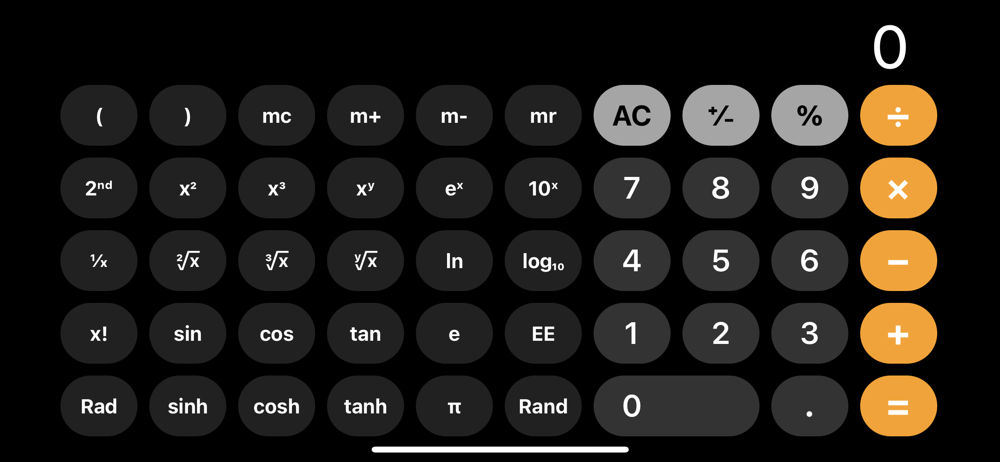

# HabuCalc

プログラミング初心者が計算機を作ろうと四苦八苦しているリポジトリです。 
完成までどれくらいかかるかわかりませんが、コツコツやっております。 

- [HabuCalc](#habucalc)
  - [目標](#目標)
  - [進捗状況](#進捗状況)
    - [2023/09/15](#20230915)
    - [2023/09/16](#20230916)
    - [2023/09/18](#20230918)
    - [2023/09/24](#20230924)
    - [2023/09/26](#20230926)
    - [2023/09/27](#20230927)
    - [2023/09/29](#20230929)
    - [2023/09/30](#20230930)
    - [2023/10/01](#20231001)
    - [2023/10/02](#20231002)
    - [2023/10/03](#20231003)
    - [2023/10/09](#20231009)
    - [2023/10/10](#20231010)
    - [2023/10/11](#20231011)
    - [2023/10/27](#20231027)
    - [2023/10/28](#20231028)
    - [2023/10/30](#20231030)
      - [Mode1](#mode1)
      - [Mode2](#mode2)
    - [2023/10/31](#20231031)
    - [2023/11/02](#20231102)
    - [2023/11/06](#20231106)
    - [2023/11/07](#20231107)
    - [2023/11/10](#20231110)
    - [2023/11/11](#20231111)
    - [2023/11/12](#20231112)
    - [2023/11/13](#20231113)
    - [2023/11/14](#20231114)
    - [2023/11/16](#20231116)

## 目標
iOSの計算機app並の機能を備えた計算機をプログラムする

## 進捗状況
### 2023/09/15
数値を画面に表示できるようにした。
1. 最初の画面('0'が表示されている場合)、'0'や'00'を押しても画面に表示しない。
2. '0'や'00'以外の数字を押すと初期の'0'を置き換える
3. 1から9までの数字を押すことで、連続した数値を入力することができるように。

**TODO**
- [ ] 小数点を取り扱えるようにする
  - [x] 小数点'.'を押した時、画面に自動的に'0.'を表示する
  - [x] 2個以上の小数点を入力できないようにする
  - [ ] 小数点以下の桁数の制限
  - [ ] エラーハンドリングの実装

### 2023/09/16
小数点ボタン'.'を押した際に'0.'と表示されるようにした。
- [x] 小数点を押下後にオペレータを押したときの挙動を設定する

### 2023/09/18
計算のための`class`を記述した。
- [x] 表示値をオペランドとして呼び出せるようにする
- [x] オペレータボタンを押した時、正しくメソッドを呼び出せるようにする

### 2023/09/24
オペランドAとオペランドBをそれぞれ変数に格納できるようにした
- [x] 各オペランドをメソッドの引数に代入して計算を実行する

### 2023/09/26
**進捗**
- 基本的な計算機能を実装した
- ファイルを整理

**TODO**
- [x] `%`と`±`の挙動を改善する(押下して即表示させる)
- [x] `Clear`と`ClearEntries`の機能を実装する

### 2023/09/27
transfomerの扱いを検討中

**TODO**
- [x] 続けて計算できないバグを修正する
  - [x] イコールを押した後に計算を続けるパターン
  - [x] イコールを押さずに計算を続けるパターン
    - [x] 新たな条件部: 両オペランド入力済みかつオペレータが押された時
      - [x] オペレータが押された時点で一時的な計算結果を表示する
      - [x] 一時的な計算結果はオペランドAとする
      - [x] オペランドBの入力を受け付ける

### 2023/09/29
- オペランドBの入力にバグあり
- 表示位置を左側に変更

### 2023/09/30
**進捗**
- Clear, ClearEntries機能を実装
- 計算ログを追加
- ログのクリアボタンを追加

### 2023/10/01
**進捗**
- オペランドBの入力は'0'から開始するように変更
  - オペランドB入力開始時まではオペランドAの表示は保持したかったがどうしてもうまく行かない
  - オペランドAを表示する`<input>`を追加して対応

**TODO**
- [x] 計算の続行に関しての挙動を修正する(2023/09/27のTODO)
- [ ] キーボード入力に対応する
  - [x] 数字
  - [ ] オペレータ
- [ ] スマホ操作に対応する
- [ ] 選択中のオペレータのスタイルを切替可能にする
  - [ ] 選択中のオペレータは反転させる等

### 2023/10/02
**進捗**
- 数字のみボタン入力に対応

**TODO**
- [ ] オペレータボタンもキー入力に対応させる

### 2023/10/03
- 機能制限版用のディレクトリを追加
  - 連続計算機能の実装のみを行う

**TODO**
- [x] オペレータ -> イコールを押したときの挙動を修正する
  - [x] 表示された'0'で計算してしまう

### 2023/10/09
- ログ出力用の関数を記述(script_limited.js)

### 2023/10/10
- イベントリスナーを整理(script_limited.js)

### 2023/10/11
- 連続計算するためには、必ず'='を押さなければならない
  - '='を押すことなくオペレータを押すことで適切な処理をするには...
  - オペレータに'='と同等の機能を持たせればいい(はず)

### 2023/10/27
- [x] limited-verのコードを応用してnormal-ver(script3.js)を書き換える

### 2023/10/28
- `script3.js`を追加
- ディレクトリのファイルを整理
  - `limited-ver`を移動
  - `index.html`をルートディレクトリに移動

### 2023/10/30
- `index.html`で一通りの計算ができるように
- `data-transformation`を`data-symbols`に変更
- `script3.js`でシンボルを扱うメソッドを追加
  - `%`や`±`を使えるようにした

- [ ] 初期の表示を0にする
- [x] キーボード入力に対応させる
  - 検証しやすくするためにこちらを優先したい
- [ ] スマホ操作に対応させる
- [x] 新しいシンボルを追加する(スクリプトは後回し)

#### Mode1
| Symbol        | Name               | Func                                           | JPN            |
| ------------- | ------------------ | ---------------------------------------------- | -------------- |
| $()$          | Parentheses        | -                                              | かっこ         |
| mc            | Memory Clear       | メモリを消去する                               | -              |
| m+            | Memory Plus        | 表示値をメモリに足す                           | -              |
| m-            | Memory Minus       | 表示値をメモリから引く                         | -              |
| mr            | Memory Recall      | メモリに保存されている値を呼び出す             | -              |
| $2ⁿᵈ$         | -                  | 一部のボタンを代替機能に切り替える             | -              |
| $x²$          | Squared            | 表示値の平方を計算する                         | 二乗           |
| $x³$          | Cubed              | 表示値の立法を計算する                         | 三乗           |
| $xʸ$          | Exponentiation     | 表示値を指数,次の入力値を底として計算する      | y乗            |
| $eˣ$          | Napier's constant  | eを底,表示値を底として計算する                 | 指数関数       |
| $10ˣ$         | Power of 10        | 10を底，表示値を指数として計算する             | 十のべき       |
| $1/x$         | Reciprocal         | 表示値の逆数を計算する                         | 逆数           |
| $²√x$         | Square root        | 表示値の平方根を計算する                       | 平方根         |
| $³√x$         | Cube root          | 表示値の立方根を計算する                       | 三乗根         |
| $ʸ√x$         | y-th root of x     | 表示値のn乗根を計算する(nは次の入力値)         | xのy乗根       |
| $In$          | Natural logarithm  | 表示値の自然対数を計算する                     | 自然対数       |
| $log₁₀$       | Common logarithm   | 10を底とする表示値の対数を計算する             | 常用対数       |
| $x!$          | Factorial          | 表示値の階乗を計算する                         | 階乗           |
| $sin$         | Sine               | 表示値のサインを計算する                       | サイン         |
| $cos$         | Cosine             | 表示値のコサインを計算する                     | コサイン       |
| $tan$         | Tangent            | 表示値のタンジェントを計算する                 | タンジェント   |
| $e$           | Napier's constant  | e(2.71828...)を入力する                        | ネイピア数     |
| EE            | Enter Exponent     | 指数表現                                       | 指数入力       |
| $Rad$ / $Deg$ | Radian / Degree    | 度とラジアンを切り替える                       | ラジアン       |
| $sinh$        | Hyperbolic sine    | 表示値のハイパーボリックサインを計算する       | 双曲線正弦関数 |
| $cosh$        | Hyperbolic cosine  | 表示値のハイパーボリックコサインを計算する     | 双曲線余弦関数 |
| $tanh$        | Hyperbolic tangent | 表示値のハイパーボリックタンジェントを計算する | 双曲線正接関数 |
| $π$           | pi                 | 円周率を入力する                               | 円周率         |
| $Rand$        | Random             | 0から1までの乱数を生成する                     | ランダム       |

#### Mode2
| Symbol      | Name | Func                                           | JPN |
| ----------- | ---- | ---------------------------------------------- | --- |
| $y^x$       | -    | 次の入力値を底,表示値を指数として計算する      | -   |
| $2^x$       | -    | 2を底,表示値を指数として計算する               | -   |
| $log_y$     | -    | 表示値の対数を,次の入力値の底で計算する        | -   |
| $log_2$     | -    | 2を底とする表示値の対数を計算する              | -   |
| $sin^{-1}$  | -    | 表示値の逆サインを計算する                     | -   |
| $cos^{-1}$  | -    | 表示値の逆コサインを計算する                   | -   |
| $tan^{-1}$  | -    | 表示値の逆タンジェントを計算する               | -   |
| $sinh^{-1}$ | -    | 表示値のハイパーボリックサインを計算する       | -   |
| $cosh^{-1}$ | -    | 表示値のハイパーボリックコサインを計算する     | -   |
| $tanh^{-1}$ | -    | 表示値のハイパーボリックタンジェントを計算する | -   |

### 2023/10/31
- キーボード入力に対応
- キーボードでの操作方法をHTMLに記述,CSSも調整

**TODO**
- [ ] キーボード入力時のログ出力を調整する

### 2023/11/02
- iOSの計算機を模倣してHTMLに新たなボタンを追加
  - 機能はせず。これから実装予定。
- ボタンの追加に伴いCSSレイアウトを調整

### 2023/11/06
- 数字の英単語を入力すると該当する数値がコンソールに表示されるようにした

**TODO**
- [ ] 単語入力に関するエラーハンドリングを実装する
- [ ] 単語で入力した数値をオペランドにできるようにする
- [ ] 数字の単語のほか、オペレータやシンボルにも対応する

### 2023/11/07
- 数字の英単語を入力し<kbd>Enter</kbd>を押すとログウィンドウに表示されるようにした
- `<input>`に`placeholder`属性を追加し、入力フィードでの操作をわかりやすくした
- 英単語と記号を対応させた`operator`と`symbol`のオブジェクトを追加

**TODO**
- [ ] オペレータとシンボルも入力に対応させる

### 2023/11/10
- $x^2$, $x^3$, $e^x$, $10^x$, $x!$の計算に対応

### 2023/11/11
- $e^x$を修正
- $x!$にエラーハンドリングを追加
- 計算機能の追加
  - $1/x$, $2√x$, $3√x$, $ln$, $log10$, $sin$, $sinh$, $cos$, $cosh$, $tan$, $tanh$, $π$, $e$, $EE$, $Rand$

- [ ] ボタンを拡張する(2nd)に対応する
- [x] パラメータで計算の方法(ラジアンと度数法)を変更可能にする

### 2023/11/12
- htmlでボタンを追加
- 三角関数はラジアンと度数法で計算できるように
- 逆三角関数の計算ができるように
- $sin$, $cos$, $tan$ のメソッドを整理

**TODO**
- [x] 三角関数のコードにエラーハンドリングを追加する
- [ ] 入力のみの機能を整理する
  - [ ] $e$, $π$, $Rand$,
- [ ] ボタン配置を整理する
- [x] エラーメッセージをログに表示する関数を作成する

### 2023/11/13
- エラーハンドリングをログウィンドウに表示する関数とオブジェクトを記述
- エラーの表示にアニメーションを追加
- 三角関数のメソッド `sin(mode)`, `cos(mode)`, `tan(mode)`それぞれにエラーハンドリングを追加

**TODO**
- [ ] $()$ を使った計算を実装する
- [ ] `mc`, `m+`, `m-`, `mr` の機能を実装する
- [ ] ログ表示を改良する(macOSの計算機を参考にする)

### 2023/11/14
- [ ] キー入力に不具合あり
  - [ ] ハイフンの入力
  - [ ] <key>Enter</key>
- [ ] キー入力用のオペレータ配列を作る

### 2023/11/16
- ショートカットキーは廃止
- `script4.js`を作成
  - `logMessages(button)`を改良
  - `class`が未完成のため、計算機能は一時的に使用不可能に

**TODO**
- [ ] `class`を機能毎に分割する
- [ ] 各`class`の`constructor`を設定し直す
- [ ] イベントリスナーなどが参照する`class`を変更する
- [ ] `ErrorHandler`を設定する

🐍 <ｼｬ-!
