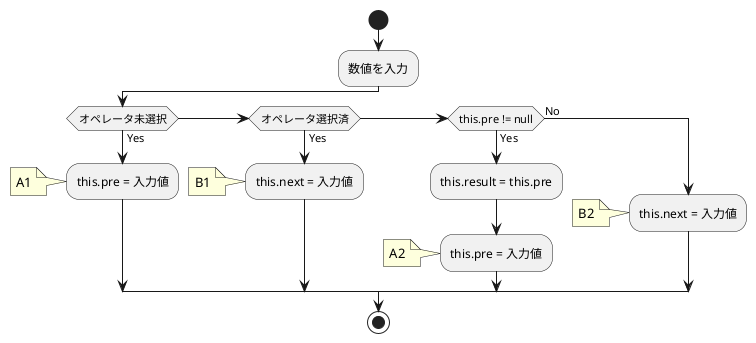
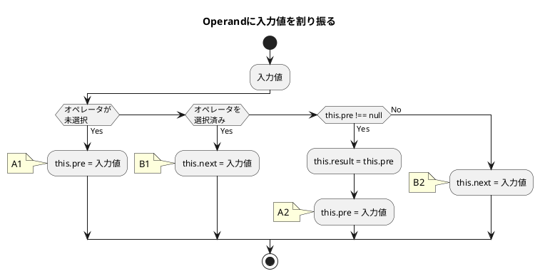
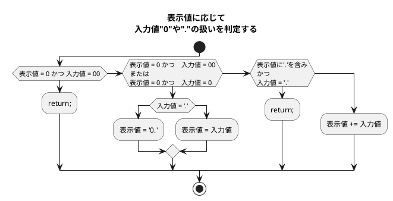

# my-vanilla-cal(機能制限版)
- [my-vanilla-cal(機能制限版)](#my-vanilla-cal機能制限版)
  - [連続計算機能(Continuous calculation function)](#連続計算機能continuous-calculation-function)
  - [問題](#問題)
    - [イコールを押したあとの計算](#イコールを押したあとの計算)

## 連続計算機能(Continuous calculation function)
イコールが押されるまで連続して計算し続けられる計算機を作る。

- 数字ボタンは3つ
- オペレータは'+'一つ
- イコール'='
- ディスプレイとサブディスプレイ
- 'C'と'CE'
- ログ出力




---

---


## 問題
### イコールを押したあとの計算
- 最初の計算は問題ない
- イコールを押し、オペレータを押した時に問題が起こる
- イコール押下後のResultはオペレータ押下後にOperandAに代入する
- `OperandB: 35`となってしまっているのは、`setOperand`に問題がある
- サブディスプレイの表示も更新されていない
```
入力: 12 + 23 =
AnyOperator
  OperandA: 12
  OperandB: null
  currentOperator: +
  Result: null
  currentStage: operator

出力: 35
Equal
  OperandA: 12
  OperandB: 23
  currentOperator: +
  Result: 35
  currentStage: result

入力: + 3 =
AnyOperator
  OperandA: 12 <- ここは'35'となるべき
  OperandB: 35 <- 新規の計算なので'0'にするべき.Resultが代入されているのはおかしい
  currentOperator: +
  Result: 35
  currentStage: operator

出力: 15
Equal
  OperandA: 12　<- 本来Resultの値が代入されるべき
  OperandB: 3 <- '3'が代入されているのはOK
  currentOperator: +
  Result: 15
  currentStage: result
```