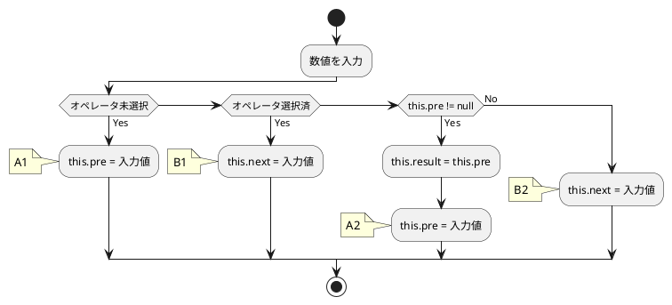
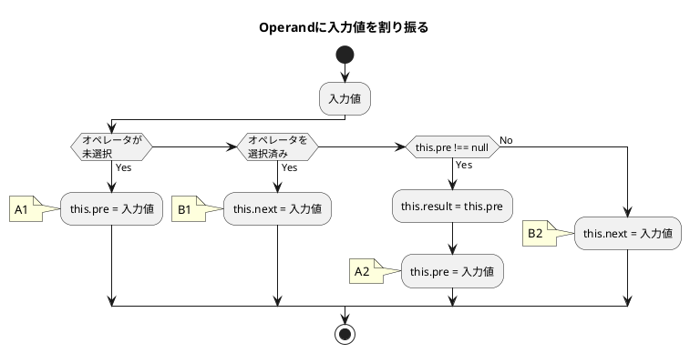
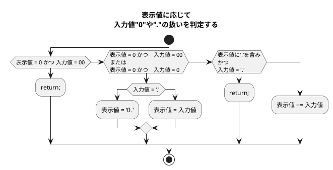

# my-vanilla-cal(機能制限版)
- [my-vanilla-cal(機能制限版)](#my-vanilla-cal機能制限版)
  - [連続計算機能(Continuous calculation function)](#連続計算機能continuous-calculation-function)
  - [問題](#問題)
    - [イコールを押したあとの計算](#イコールを押したあとの計算)
  - [Code置き場](#code置き場)
    - [2023/10/14](#20231014)
  - [Vanilla-JavaScript-Calculatorとの比較](#vanilla-javascript-calculatorとの比較)
    - [オペレーションの入力を受け付ける`chooseOperation()`](#オペレーションの入力を受け付けるchooseoperation)
    - [オペランドをもとに計算を実行する`compute()`](#オペランドをもとに計算を実行するcompute)
    - [入力された数字をプロパティに代入する`appendNumber()`](#入力された数字をプロパティに代入するappendnumber)
    - [`number`を整形して表示可能な形式にする`getDisplayNumber()`](#numberを整形して表示可能な形式にするgetdisplaynumber)
    - [イベントリスナーから送られた数値を表示する`updateDisplay()`](#イベントリスナーから送られた数値を表示するupdatedisplay)
  - [応用するには](#応用するには)
  - [問題と解決](#問題と解決)
    - [ディスプレイに数字が表示されない問題](#ディスプレイに数字が表示されない問題)
  - [コード置き場](#コード置き場)

## 連続計算機能(Continuous calculation function)
イコールが押されるまで連続して計算し続けられる計算機を作る。

- 数字ボタンは3つ
- オペレータは'+'一つ
- イコール'='
- ディスプレイとサブディスプレイ
- 'C'と'CE'
- ログ出力




---

---


## 問題
### イコールを押したあとの計算
- 最初の計算は問題ない
- イコールを押し、オペレータを押した時に問題が起こる
- イコール押下後のResultはオペレータ押下後にOperandAに代入する
- `OperandB: 35`となってしまっているのは、`setOperand`に問題がある
- サブディスプレイの表示も更新されていない
```
入力: 12 + 23 =
AnyOperator
  OperandA: 12
  OperandB: null
  currentOperator: +
  Result: null
  currentStage: operator

出力: 35
Equal
  OperandA: 12
  OperandB: 23
  currentOperator: +
  Result: 35
  currentStage: result

入力: + 3 =
AnyOperator
  OperandA: 12 <- ここは'35'となるべき
  OperandB: 35 <- 新規の計算なので'0'にするべき.Resultが代入されているのはおかしい
  currentOperator: +
  Result: 35
  currentStage: operator

出力: 15
Equal
  OperandA: 12　<- 本来Resultの値が代入されるべき
  OperandB: 3 <- '3'が代入されているのはOK
  currentOperator: +
  Result: 15
  currentStage: result
```
| No. | Input | Stage    | Process                                   |
| --- | ----- | -------- | ----------------------------------------- |
| 1   | "1"   | number   | `this.pre`の入力受付                      |
| 2   | "+"   | operator | No.1を`this.pre`に                        |
| 3   | "2"   | number   | `this.next`の入力受付                     |
| 4   | "+"   | operator | 計算実行し以下のようにする                |
| -   | -     | -        | 1. `this.result = this.pre + this.result` |
| -   | -     | -        | 2. `preOperand.value = this.pre`          |
| -   | -     | -        | 2. `this.result = this.pre`               |
| -   | -     | -        | 3. `result.value = 0`                     |
| -   | -     | -        | 4. `this.next = null`                     |
| 5   | "3"   | number   |

---
## Code置き場
### 2023/10/14
```js
class Calculator {
    constructor() {
        this.pre = null;
        this.next = null;
        this.selectedOperator = null;
        this.result = null;
    }

    setOperand(value) {
        if (currentStage === 'operandA') {
            this.pre = parseFloat(value);
        } else if (currentStage === 'operandB') {
            this.next = parseFloat(value);
        }
    }

    add() {
        this.result = this.pre + this.next;
        return this.result;
    }

    reset() {
        this.pre = null;
        this.next = null;
        this.selectedOperator = null;
        this.result = null;
    }

    getResult() {
        return this.result;
    }
}

const buttons = document.querySelectorAll('button');
const result = document.getElementById('result');
const preOperand = document.getElementById('previousOperand');
const resultLog = document.querySelector('.result-log');
const clearLog = document.getElementById('clearLog');

let currentStage = 'operandA';
// 1.'operandA'
// 2.'operator'
// 3.'operandB'
// 4.'equal'

const calculator = new Calculator();
let currentOperator = null;
let currentButton = null;

function logMessages(pre, next, operator, result, currentStage) {
    const forConsole = `\nOperandA: ${pre} \nOperandB: ${next} \ncurrentOperator: ${operator} \nResult: ${result} \ncurrentStage: ${currentStage}`;
    const forDisplay = `<br>OperandA: ${pre} <br>OperandB: ${next} <br>currentOperator: ${operator} <br>Result: ${result} <br>currentStage: ${currentStage}`;

    if (currentButton === '+' || currentButton === '-' || currentButton === '×' || currentButton === '÷') {
        console.log('AnyOperator' + forConsole);
        displayLog('AnyOperator' + forDisplay);
        return;
    } else if (currentButton === '=') {
        console.log('Equal' + forConsole);
        displayLog('Equal' + forDisplay);
        return;
    } else if (currentButton === 'C') {
        console.log('Cleared' + forConsole);
        displayLog('Cleared' + forDisplay);
        return;
    } else if (currentButton === 'CE') {
        console.log('ClearEntries' + forConsole);
        displayLog('ClearEntries' + forDisplay);
    }
}

function displayLog(result) {
    const resultPara = document.createElement('p');
    resultPara.classList.add('resultPara');
    resultLog.appendChild(resultPara);
    resultPara.innerHTML = result;
    resultLog.scrollTop = resultLog.scrollHeight;
}

function numberProcess(number) {
    const numberText = number.getAttribute('data-numbers');

    if (result.value === '0' && numberText === '00') {
        result.value = '0';
    } else if (
        (result.value === '0' && numberText !== '00') ||
        (result.value === '0' && numberText !== '0')) {
        if (numberText === '.') {
            result.value = '0.';
        } else {
            result.value = numberText;
        }
    } else if (
        (result.value.indexOf('.') !== -1) &&
        (numberText === '.')
    ) {
        return;
    } else {
        result.value += numberText;
    }
}

function handleResult(operator) {
    const isOperator = operator === '+' || operator === '-' || operator === '×' || operator === '÷';

    if (isOperator) {
        calculator.setOperand(result.value);//OpeAへ
        calculator.selectedOperator = currentOperator = operator;
        preOperand.value = calculator.pre;
        result.value = '0';

        logMessages(calculator.pre, calculator.next, calculator.selectedOperator, calculator.result, currentStage);

    } else if (operator === '=') {
        calculator.setOperand(result.value);//OpeBへ
        switch (calculator.selectedOperator) {
            case '+':
                calculator.add();
                result.value = calculator.getResult().toString();
                break;
            default:
        }
        logMessages(calculator.pre, calculator.next, calculator.selectedOperator, calculator.result, currentStage);

    } else if (currentStage === 'operator' && this.next !== null) {
        switch (calculator.selectedOperator) {
            case '+':
                calculator.add();
                preOperand.value = calculator.getResult().toString();
                break;
            default:
        }
        logMessages(calculator.pre, calculator.next, calculator.selectedOperator, calculator.result, currentStage);
    }
}

function clearProcess() {
    calculator.reset();
    result.value = '0';
    preOperand.value = '0';

    logMessages(calculator.pre, calculator.next, calculator.selectedOperator, calculator.result, currentStage);
}

function ceProcess() {
    result.value = '0';

    logMessages(calculator.pre, calculator.next, calculator.selectedOperator, calculator.result, currentStage);
}

result.value = '0';
preOperand.value = '0';
buttons.forEach(button => {
    button.addEventListener('click', () => {
        const buttonText = button.innerHTML;
        currentButton = buttonText;
        const isNumber = /^[0-9]+$/.test(buttonText);
        const isOperator = buttonText === '+' || buttonText === '-' || buttonText === '×' || buttonText === '÷';
        if (isNumber) {
            numberProcess(button);
            if (calculator.pre !== null) { //!
                currentStage = 'operandB';
            } else {
                currentStage = 'operandA';
            }
        } else if (isOperator) {
            handleResult(buttonText);
            currentStage = 'operator';
        } else if (buttonText === '=') {
            handleResult(buttonText);
            currentStage = 'equal';
        } else if (buttonText === 'C') {
            clearProcess();
            currentStage = 'operandA';
        } else if (buttonText === 'CE') {
            ceProcess();
        } else if (buttonText === 'CLEAR') {
            const removeParas = document.querySelectorAll('.resultPara');
            removeParas.forEach(para => {
                para.remove();
                console.log('Logs Cleared');
            });
        }
        console.log('currentStage:' + currentStage);
    });
});
```

## Vanilla-JavaScript-Calculatorとの比較
1. 数値を格納する変数/プロパティは"過去"と"現在"のみ
2. メソッドは
   1. `appendNumber()`: 数値の振り分けと追加
   2. `chooseOperation()`: オペレータを選択したときのオペランドの操作や計算の実行
   3. `compute()`: 入力されたオペレータに応じてオペランドで計算する
   4. `getDisplayNumber()`: 数値を表示可能な文字列に整形する
   5. `updateDisplay()`: 受け取った数値を画面に表示する
   6. `clear()`: クリアボタンを押した時にリセットする
   7. `delete()`: 数列の後ろ一文字を削除する

### オペレーションの入力を受け付ける`chooseOperation()`
1. パラメータ`(operation)`に送られたオペレータ文字列を`this.operation`に代入
   1. `this.operation`は`compte()`の計算実行やサブ画面の表示に用いられる
2. 両方のオペランドが揃っているときのみ計算が実行されるようになっている
3. オペレータボタンを押した時点で
   1. `this.previousOperand = this.currentOperand;` で数値を前オペランドに移動し
   2. `this.currentOperand = '';` で現オペランドを空にする

```js
  chooseOperation(operation) {
    if (this.currentOperand === '') return;
    //currentOperandが空であるとき、何もしない
    if (this.previousOperand !== '') {
      this.compute();
      //previousOperandが入力されているとき計算を実行する
    }

    this.operation = operation;
    // 入力されたオペレータをthis.operationに代入
    // ->`compute()`で使用可能にする
    this.previousOperand = this.currentOperand;
    // オペレータを選択すると、今のオペランドをpreviousオペランドに代入する
    this.currentOperand = '';
    // currentOperandはprevに渡したので、新規の数値を受け付けるために空にする
  }
```

### オペランドをもとに計算を実行する`compute()`
1. 四則演算などは、すべて`compute()`メソッドが行っている
2. `let computation`: 結果を格納する変数
3. `appendNumber()`から送られた数字の文字列を`prev`定数に代入
4. `chooseNumber()`から送られた`this.currentOperand`の数値を`current`定数に代入
5. `prev`または`current`が数値でないときは何もせず`return`
6. `chooseOperation()`で実行されて`this.operation`をもとに計算を実行する
7. 計算結果は`this.currentOperand = computation`で渡される
8. 計算後、`this.operation`はリセットされる
9. 計算後、`this.previousOperand = ''`はリセットされる

8~9は連続計算に必要なカギ

```js
  compute() {
    let computation
        //結果を格納する変数
    const prev = parseFloat(this.previousOperand)
    const current = parseFloat(this.currentOperand)
    if (isNaN(prev) || isNaN(current)) return
    switch (this.operation) {
      case '+':
        computation = prev + current
        break
      case '-':
        computation = prev - current
        break
      case '*':
        computation = prev * current
        break
      case '÷':
        computation = prev / current
        break
      default:
        return
    }
    this.currentOperand = computation
      // 計算結果をcurrentOperandに代入する
    this.operation = undefined
      // `this.operation`で計算した後、リセットする
    this.previousOperand = ''
      // previousOperandを空にする
  }
```

### 入力された数字をプロパティに代入する`appendNumber()`
1. 各メソッドで用いられる数字は最初にここで処理される
2. `this.currentOperand = this.currentOperand.toString() + number.toString();`
   1. `this.currentOperand`に、入力された数字を後ろから追加するためのコード
3. `this.previousOperand`は`chooseOperation()`で使用可能にする

```js
appendNumber(number) {//数値の振り分け、追加
    if (number === '.' && this.currentOperand.includes('.')) return;
    //入力が '.' かつ currentOperand に '.' が含まれている場合に何もしない
    this.currentOperand = this.currentOperand.toString() + number.toString();
}
```

### `number`を整形して表示可能な形式にする`getDisplayNumber()`
1. `updateDisplay()`から送られた数文字列を処理する
2. 小数点がある場合、数文字列を'.'で分割し整数部分と小数部分を分ける
3. 整数部分は`toLocalString`で読みやすい形式に直せるように`parseFloat`で数値にする
4. 小数部分があるとき、`${integerDisplay}.${decimalDigits}`で整数と連結して返す
5. 小数部分がなければそのまま整数部分のみを返す

```js
  getDisplayNumber(number) {//numberを整形してディスプレイに表示する文字列を生成する関数
    const stringNumber = number.toString();

    const integerDigits = parseFloat(stringNumber.split('.')[0]);
    //stringNumberを'.'で分割し、整数部分を定数に代入する
    const decimalDigits = stringNumber.split('.')[1];
    //'.'で分割し、インデックスの1番目の部分以降(小数点以下の桁)を定数に代入する
    let integerDisplay;

    if (isNaN(integerDigits)) {
      integerDisplay = '';
      //integerDigitsが数値でないとき(存在しないとき)に空文字列を代入する
    } else {
      integerDisplay = integerDigits.toLocaleString('en', { maximumFractionDigits: 0 });
      //整数部分が数値のとき、整数としてフォーマットし、
      //大きな数値を読みやすい形式で表示できるようにする
    }

    if (decimalDigits != null) {
      return `${integerDisplay}.${decimalDigits}`;
      //小数部分があるとき、整数部分と小数部分を連結して返す。
    } else {
      return integerDisplay;
      //小数部分がないとき、整数部分のみを返す
    }
  }
```

### イベントリスナーから送られた数値を表示する`updateDisplay()`
1. `this.currentOperandTextElement.innerText`に
   1. `getDisplayNumber()`で処理された`this.currentOperand`の値を数文字列として代入
2. オペレータが入力されているときは、前オペランドの値をサブディスプレイに表示する
   1. `this.previousOperand`への代入は`chooseOperation()`が行う

```js
  updateDisplay() {//イベントリスナーから送られた数値を表示する
    this.currentOperandTextElement.innerText = this.getDisplayNumber(this.currentOperand);
    //`this.getDisplayNumber(this.currentOperand)`を使って整形した文字列を
    //`this.currentOperandTextElement.innerText`に設定する
    //現在の数値の表示を更新する

    if (this.operation != null) {
      this.previousOperandTextElement.innerText =
        `${this.getDisplayNumber(this.previousOperand)} ${this.operation}`;
        // operationが入力されているとき
        // サブディスプレイに`this.getDisplayNumber(this.previousOperand)の値と
        //operationの文字列を表示する

    } else {
      this.previousOperandTextElement.innerText = '';
      // operationが未設定のとき、サブディスプレイに空文字が代入される
    }
  }
```

## 応用するには
1. プロパティや変数は減らす
2. プロパティの名前を`pre`と`cur`にする
3. `selectedOperator`は`operator`に
4. 機能はすべて`class`内で
5. 入力値は数値に変換した上で表示させる
   1. `numberProcess()`を省ける
6. currentStageは廃止

## 問題と解決
### ディスプレイに数字が表示されない問題
```js
this.currentOperandTextElement.innerText = this.getDisplayNumber(this.currentOperand);
```
このコードがメインディスプレイに文字列を表示させるはずだったが、
なぜか表示されなかった。
```html
<input type="text" name="screen" id="currentOperand" readonly>
```
原因は`input`要素に`.innerText`で文字列を表示させようとしていたため。
```js
this.currentOperandTextElement.value = this.getDisplayNumber(this.currentOperand);
```
このようにすることで問題なく数字の文字列が表示できるようになった。

## コード置き場
```js
// const numberButtons = document.querySelectorAll('[data-numbers]');
// const operationButtons = document.querySelectorAll('[data-operation]');
// const equalsButton = document.querySelector('[data-equal]');
// const clearButton = document.querySelector('[data-clear]');
// const clearEntriesButton = document.querySelector('[data-clearEntries]');

// numberButtons.forEach(button => {
//     button.addEventListener('click', () => {
//         calculator.appendNumber(button.innerText);
//         calculator.updateDisplay();
//     });
// });

// operationButtons.forEach(button => {
//     button.addEventListener('click', () => {
//         calculator.chooseOperation(button.innerText);
//         calculator.updateDisplay();
//     });
// });

// equalsButton.addEventListener('click', button => {
//     calculator.compute();
//     calculator.updateDisplay();
// });

// clearButton.addEventListener('click', button => {
//     calculator.clear();
//     calculator.updateDisplay();
// });

// clearEntriesButton.addEventListener('click', button => {
//     calculator.clearEntries();
//     calculator.updateDisplay();
// });
```