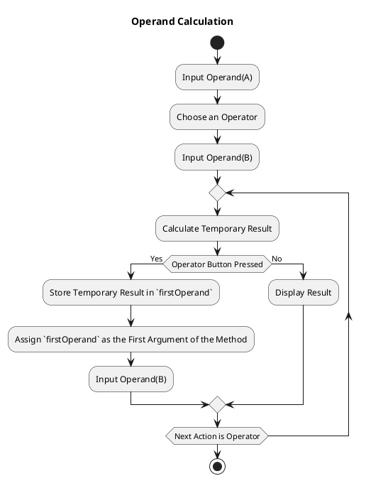

# ChatGPTに訊いたこと
GPTに質問したことをメモします。

- [ChatGPTに訊いたこと](#chatgptに訊いたこと)
  - [計算機を作るのに役に立つオブジェクトは？](#計算機を作るのに役に立つオブジェクトは)
    - [JSの”数値オブジェクトについて”](#jsの数値オブジェクトについて)
    - ["表示する"ためのもの](#表示するためのもの)
    - ["履歴"を残す](#履歴を残す)
  - [`class`について](#classについて)
  - [配列を使うアイディア](#配列を使うアイディア)
    - [変数は生成できない](#変数は生成できない)
  - [正しい`class`の書き方](#正しいclassの書き方)
    - [他のオペレータのメソッド](#他のオペレータのメソッド)
  - [条件分岐: イコールかオペレータか](#条件分岐-イコールかオペレータか)
  - [アクティビティ図の注意点](#アクティビティ図の注意点)
    - [修正例](#修正例)
  - [コンストラクター](#コンストラクター)
    - [JSのコンストラクターとは?](#jsのコンストラクターとは)
      - [同じプロパティとメソッドを持つオブジェクトを簡単に作成できる](#同じプロパティとメソッドを持つオブジェクトを簡単に作成できる)
    - [クラスを使ったコンストラクターとは?](#クラスを使ったコンストラクターとは)
    - [呼び出し部分について](#呼び出し部分について)
    - [新しいオブジェクト(=インスタンス)に独自のプロパティを追加可能](#新しいオブジェクトインスタンスに独自のプロパティを追加可能)
  - [functionの基本](#functionの基本)
    - [functionの場所](#functionの場所)
    - [巻き上げとは](#巻き上げとは)

## 計算機を作るのに役に立つオブジェクトは？
計算機を作成する際に役立つさまざまなオブジェクトがあります。以下は、計算機アプリケーションの開発において一般的に使用されるオブジェクトのいくつかです：

1. **数値オブジェクト**: <br>計算機は数値演算を行うため、数値を表現および操作するための数値オブジェクトが重要です。<br>主要な数値型オブジェクトには整数 (`int`)、浮動小数点数 (`float`) が含まれます。<br>これらのオブジェクトは計算機が数値計算を行う際に使用されます。

2. **文字列オブジェクト**: <br>ユーザーからの入力を受け取り、表示するために文字列オブジェクトが必要です。<br>文字列オブジェクトはテキストデータを表現し、文字列操作（例：連結、分割、置換など）を実行するのに使用されます。

3. **ボタンオブジェクト**: <br>計算機のユーザーインターフェースでボタンを表現するためのボタンオブジェクトが必要です。<br>これらのオブジェクトはユーザーが数値や演算子を入力するために使用され、<br>クリックイベントなどのアクションをトリガーします。

4. **演算子オブジェクト**: <br>計算機は数値演算を行うため、演算子を表現および操作するオブジェクトが必要です。<br>演算子オブジェクトは計算機の動作を制御し、数値演算を実行します。

5. **計算エンジンオブジェクト**: <br>計算機の中核部分は計算エンジンであり、数値演算や計算の制御を担当します。<br>これは計算機の主要なロジックを実装するオブジェクトで、<br>数式の解析や計算結果の追跡などを行います。

6. **表示オブジェクト**: <br>計算機の表示を管理するための表示オブジェクトが必要です。<br>これらのオブジェクトは数値や計算結果をユーザーに表示し、<br>ユーザーが操作した内容を表示します。

7. **履歴オブジェクト**: <br>計算機が計算の履歴を保持し、過去の計算結果を参照できるようにする場合、<br>履歴オブジェクトが必要です。<br>これは計算の記録と復元を管理します。

8. **エラーハンドリングオブジェクト**: <br>計算機がエラー処理を実装する場合、エラーハンドリングオブジェクトが役立ちます。<br>エラーハンドリングオブジェクトはエラーの検出と適切なエラーメッセージの表示を担当します。

これらのオブジェクトは、計算機アプリケーションの開発において一般的に使用されます。  
計算機の機能や要件に応じて、これらのオブジェクトを組み合わせて計算機を設計および実装します。  
また、計算機アプリケーションがウェブベースである場合、  
JavaScriptを使用してこれらのオブジェクトを実装することが一般的です。

--------------------

### JSの”数値オブジェクトについて”

JavaScriptにおいて、数値を操作するための組み込みオブジェクトや関数がいくつか提供されています。以下は主要なものです：

1. **Number オブジェクト**: <br>JavaScriptにおける数値は、Number オブジェクトで表されます。<br>このオブジェクトには、数値を操作するためのメソッドやプロパティが含まれています。<br>例えば、数値の四捨五入や小数点以下の桁数を制御するためのメソッドがあります。

   ```javascript
   let num = 123.456;
   let rounded = num.toFixed(2); // 123.46
   ```

2. **Math オブジェクト**: <br>Math オブジェクトは、数学的な操作を提供します。<br>三角関数、指数関数、対数関数など、多くの数学関数が含まれています。<br>また、最大値、最小値、乱数生成など、一般的な数値操作もサポートしています。

   ```javascript
   let x = Math.sqrt(25); // 5
   let randomNum = Math.random(); // 0 から 1 未満のランダムな数
   ```

3. **基本的な算術演算子**: <br>JavaScriptは四則演算（+、-、*、/）や、余りを求める演算子（%）、<br>比較演算子（<、>、<=、>=、===、!==）を提供します。<br>これらの演算子を使用して、基本的な算術演算を行います。

   ```javascript
   let sum = 5 + 3; // 8
   let remainder = 10 % 3; // 1
   let isEqual = 5 === 5; // true
   ```

4. **パースと変換関数**: <br>文字列から数値への変換や、数値から文字列への変換を行う関数があります。<br>これらは `parseInt()`、`parseFloat()`、`toString()` などです。

   ```javascript
   let str = "42";
   let num = parseInt(str); // 42 (文字列から整数への変換)
   let str2 = num.toString(); // "42" (数値から文字列への変換)
   ```

これらの機能を駆使して、JavaScriptでは数値を操作し、計算を行うことができます。<br>数値に対する操作は、JavaScriptの多くのアプリケーションで非常に重要です。

### "表示する"ためのもの
JavaScriptで計算機を作成するために役立つ表示に関するオブジェクトやテクニックは以下の通りです：

1. **HTML要素の操作**: <br>計算機のインターフェースを構築するために、HTML要素を操作するための方法があります。<br>代表的な方法は、`document.getElementById()`、`document.querySelector()`、<br>および `document.createElement()` メソッドを使用して要素を取得し、作成することです。

   ```javascript
   // HTML要素を取得
   const resultDisplay = document.getElementById("result");
   
   // 新しい要素を作成
   const button = document.createElement("button");
   button.textContent = "Click me";
   ```

2. **テキストの操作**: <br>計算機の画面にテキストを表示する場合、テキストコンテンツを更新するための方法が必要です。<br>これには `textContent` プロパティや `innerHTML` プロパティを使用できます。

   ```javascript
   // テキストコンテンツを更新
   resultDisplay.textContent = "Result: 42";
   ```

3. **CSSスタイリング**: <br>要素のスタイルを変更して、計算機の外観をカスタマイズできます。<br>`style` プロパティを使用してスタイルを設定できます。

   ```javascript
   // スタイルを設定
   resultDisplay.style.color = "blue";
   button.style.backgroundColor = "green";
   ```

4. **イベントハンドリング**: <br>ユーザーがボタンをクリックなどのアクションを実行した場合、<br>それに応答するためのイベントハンドラを設定することができます。

   ```javascript
   // クリックイベントハンドラを設定
   button.addEventListener("click", () => {
     // ボタンがクリックされたときの処理
   });
   ```

5. **DOMの操作**: <br>DOM（Document Object Model）を操作して、<br>要素の作成、追加、削除、属性の変更などを行うことができます。

   ```javascript
   // 新しい要素を追加
   const container = document.getElementById("container");
   container.appendChild(button);

   // 要素を削除
   container.removeChild(button);
   ```

6. **ライブラリとフレームワーク**: <br>複雑なUIコンポーネントを構築するために、ライブラリ（例: React、Vue.js）や<br>フレームワーク（例: Angular）を使用することも一般的です。

これらのテクニックとオブジェクトを組み合わせて、計算機の表示を操作し、<br>ユーザーとの対話を実現できます。<br>計算機アプリケーションの要件に合わせて、これらの技術を活用してください。

### "履歴"を残す
計算機の履歴を残すためには、JavaScriptにおいてデータを保存および<br>操作するための適切なオブジェクトやメソッドを使用することができます。<br>以下は、履歴を管理するのに役立ついくつかの方法です。

1. **配列 (Array)**: <br>計算機の計算履歴を配列に保存することができます。<br>新しい計算が行われるたびに、その結果を配列に追加します。

   ```javascript
   const history = []; // 履歴用の空の配列

   // 計算結果を履歴に追加
   function addToHistory(calculation, result) {
     history.push({ calculation, result });
   }
   ```

2. **localStorage**: <br>`localStorage` オブジェクトを使用して、<br>計算履歴をブラウザのローカルストレージに保存することができます。<br>これにより、ユーザーがページをリロードしても履歴が保持されます。

   ```javascript
   // 履歴をローカルストレージに保存
   function saveHistoryToLocalStorage() {
     localStorage.setItem("calculationHistory", JSON.stringify(history));
   }

   // ローカルストレージから履歴を読み込む
   function loadHistoryFromLocalStorage() {
     const storedHistory = localStorage.getItem("calculationHistory");
     if (storedHistory) {
       history = JSON.parse(storedHistory);
     }
   }
   ```

3. **IndexedDB**: <br>より高度なデータベース操作が必要な場合、<br>IndexedDBを使用して履歴を保存できます。<br>IndexedDBはブラウザ内のデータベースを提供します。

   ```javascript
   // IndexedDBを開いて履歴を保存
   const request = indexedDB.open("calculatorHistoryDB", 1);
   let db;

   request.onsuccess = (event) => {
     db = event.target.result;

     // 履歴をデータベースに保存
     const transaction = db.transaction("history", "readwrite");
     const historyStore = transaction.objectStore("history");
     historyStore.add({ calculation, result });
   };
   ```

4. **Cookies**: <br>履歴情報をクッキーに保存することもできます。<br>ただし、クッキーには制限があり、小規模なデータの保存に適しています。

   ```javascript
   // クッキーに履歴情報を保存
   document.cookie = `calculation=${calculation}; expires=Sat, 31 Dec 2022 23:59:59 UTC; path=/`;
   ```

5. **外部サーバーへのデータ送信**: <br>履歴情報を外部サーバーに送信し、<br>サーバーサイドでデータベースに保存する方法も考えられます。

これらの方法を組み合わせて、計算機の履歴を効果的に管理できます。<br>選択肢は計算機アプリケーションの要件に合わせて選択し、実装することが重要です。

## `class`について

もちろん、JavaScriptで`class`を使用してクラスを定義する基本的な方法について説明します。<br>`class`を使ってオブジェクト指向プログラミングを行うことができます。<br>以下は基本的な構文です。

```javascript
class Calculator {
  // コンストラクタ
  constructor() {
    // インスタンス変数の初期化
    this.result = 0;
  }

  // メソッドの定義
  add(number) {
    this.result += number;
  }

  subtract(number) {
    this.result -= number;
  }

  multiply(number) {
    this.result *= number;
  }

  divide(number) {
    if (number === 0) {
      throw new Error("Division by zero is not allowed.");
    }
    this.result /= number;
  }

  // 結果を取得するメソッド
  getResult() {
    return this.result;
  }
}

// Calculatorクラスのインスタンスを作成
const calculator = new Calculator();

// メソッドの呼び出し
calculator.add(5);
calculator.multiply(2);
calculator.subtract(3);
calculator.divide(4);

// 結果を取得
const result = calculator.getResult();
console.log(result); // 結果をコンソールに表示
```

この例では、`Calculator`というクラスを定義しています。<br>このクラスにはコンストラクタといくつかのメソッドが含まれています。<br>コンストラクタはインスタンスを初期化し、<br>メソッドはオブジェクトの振る舞いを定義します。

クラスを使用する際のポイント:

1. **コンストラクタ**: <br>`constructor` メソッドはクラスのインスタンスを初期化します。<br>ここでインスタンス変数を初期化するのが一般的です。

2. **メソッド**: <br>クラス内で定義された関数は、そのクラスのメソッドとして扱われます。<br>メソッドはオブジェクトの振る舞いを表現します。

3. **インスタンスの作成**: <br>クラスからインスタンスを作成するには、`new` キーワードを使用します。<br>例: `const calculator = new Calculator();`

4. **メソッドの呼び出し**: <br>インスタンスを使用してメソッドを呼び出します。<br>例: `calculator.add(5);`

5. **thisキーワード**: <br>インスタンス変数やメソッドにアクセスするために、`this` キーワードを使用します。<br>例: `this.result` はインスタンスの `result` 変数を参照します。

これは基本的なクラスの使い方です。計算機の例では四則演算のメソッドが含まれていますが、<br>他にもさまざまなプロパティやメソッドをクラスに追加できます。<br>計算機の機能を拡張したり、新しいクラスを作成する際に役立ちます。

## 配列を使うアイディア
おはようございます！計算式を収めるために配列を使用するのは良いアイデアです。<br>
配列を使用することで、計算式を簡単に管理し、<br>
計算履歴を取得したり、計算結果を表示するのに役立ちます。

以下に、計算式を収めるための配列を使用した基本的なアイデアを示します。

1. 配列を宣言して計算式を格納するための変数を作成します。

```javascript
const calculationExpression = [];
```

2. 数字や演算子が押されたときに、その値を配列に追加します。

```javascript
// 数字ボタンが押された場合
const numberText = number.getAttribute('data-numbers');
calculationExpression.push(numberText);

// 演算子ボタンが押された場合
const operatorText = operator.getAttribute('data-operators');
calculationExpression.push(operatorText);
```

3. 計算ボタンが押されたときに、配列内の要素を使用して計算を行います。

```javascript
// 計算ボタンが押された場合
const expressionString = calculationExpression.join(''); // 配列内の要素を文字列に変換
const result = eval(expressionString); // eval() を使用して計算
```

4. 計算結果を表示し、計算式をクリアするなどの適切な処理を行います。

このように、配列を使用することで、計算式を効果的に管理できます。<br>
計算履歴を保持するために、計算式ごとに配列を作成し、<br>
必要な情報を追加していくこともできます。<br>
計算式の履歴を保持する際には、複数の配列を管理することが考えられます。

### 変数は生成できない
JavaScriptにおいて、変数自体を動的に生成することはできません。<br>
変数はコードが実行される前に静的に定義される必要があります。<br>
しかし、動的なデータの管理や条件に応じたデータの保持には、<br>
配列やオブジェクトを使用することが一般的です。

特定の操作（例: 'C'ボタンが押されたとき）に対応する新しいデータを格納するには、<br>
既存の変数やデータ構造（配列やオブジェクト）を使用することが一般的です。<br>
新しいデータを追加するか、既存のデータをクリアすることができます。

たとえば、計算式の履歴を保持する場合、配列を使用して計算式を追加し、<br>
'C'ボタンが押されたときに配列をクリアすることができます。

```javascript
// 計算式の履歴を保持するための配列
const calculationHistory = [];

// 数字ボタンが押された場合
const numberText = number.getAttribute('data-numbers');
calculationHistory.push(numberText);

// 'C'ボタンが押された場合
if (clearButtonIsPressed) {
  calculationHistory.length = 0; // 配列をクリア
}
```

このように、データを格納するためのデータ構造を使用して、<br>
必要なデータを管理することが一般的です。

## 正しい`class`の書き方
提供されたコードの一部を見る限り、クラス `Calculator` のコンストラクタと `add` メソッドの基本的な構造は合っていますが、いくつかの点で修正が必要です。以下の修正が必要です：

1. クラスの閉じかっこ `}` が不足しています。クラスの中身を適切に閉じる必要があります。

2. コンストラクタの引数とプロパティの代入には `this` を使用しますが、提供されたコードでは `this` の参照が不足しています。コンストラクタ内で `this` を使用するには、`super()` を呼び出す必要があります。

3. `add` メソッド内で、`this.pre` と `this.next` の値が適切に設定されていることを確認する必要があります。現在のコードでは、これらの値がコンストラクタに渡されているようには見えません。

修正したコードの例を以下に示します：

```javascript
class Calculator {
    constructor(pre, next) {
        // コンストラクタでプロパティを初期化
        this.pre = pre;
        this.next = next;
    }

    add() {
        // `pre`はコンストラクタで設定された前オペランド
        // `next`はコンストラクタで設定された次のオペランド
        // 加算した数値を返す
        const addition = this.pre + this.next;
        return addition;
    }
}

// クラスのインスタンスを生成
const calculator = new Calculator(10, 5);

// 加算メソッドを呼び出して結果を表示
console.log(calculator.add()); // 出力: 15
```

上記の修正により、`Calculator` クラスが正しく機能し、加算メソッドが `pre` と `next` の値を使用して計算を行うようになります。また、クラスのインスタンスを作成してメソッドを呼び出す方法も示しています。

### 他のオペレータのメソッド
わかりました。他のオペレータのメソッドも書いてみました。正しくかけていますか？
```js
class Calculator {
    constructor(pre, next) {
        // コンストラクタでプロパティを初期化
        this.pre = pre;
        this.next = next;
    }

    add() {
        // `pre`はコンストラクタで設定された前オペランド
        // `next`はコンストラクタで設定された次のオペランド
        // 加算した数値を返す
        const addition = this.pre + this.next;
        return addition;
    }

    subtract() { //減算
        const subtraction = this.pre - this.next;
        return subtraction;
    }

    multiply() { //乗算
        const multiplications =  this.pre * this.next;
        return multiplications;
    }

    divide() { //除算
        if (this.next === 0) {
            throw new Error("0で除算はできません");
        }
        const division = this.pre / this.next;
        return division;
    }

    percent() { //％
        const presenting = this.pre * 0.01;
        return presenting;
    }

    plusOrMinus() { //±
        const plusMinus = this.pre * (-1);
        return plusMinus;
    }

    getResult() { // result
        return this.result;
    }
}
```
---

提供されたコードの各メソッドの基本的な構造は合っています。<br>各オペレータに対して計算を行うメソッドが適切に定義されており、<br>エラー処理も考慮されています。

ただし、いくつかのポイントを指摘させていただきます：

1. `getResult` メソッドの中で `this.result` を返そうとしていますが、<br>現在のコードではコンストラクタで `this.result` が<br>初期化されていないため、`undefined` を返すことになります。<br>もし `result` プロパティを使用するつもりであれば、<br>コンストラクタ内で適切に初期化する必要があります。

2. `percent` メソッドと `plusOrMinus` メソッドでは、<br>計算結果を `this.pre` に影響を与えずに返しています。<br>通常、これらのメソッドは `this.pre` の値を変更するものとして<br>想定されるでしょう。<br>したがって、これらのメソッドは `this.pre` の値を変更し、<br>変更後の値を返すようにするべきです。

3. 各メソッドはインスタンス変数 `this.pre` と `this.next` を<br>使用して計算を行っていますが、<br>コンストラクタでこれらの値を初期化する箇所がないため、<br>インスタンス生成時にこれらの値を指定しなければならないでしょう。<br>通常、コンストラクタ内で初期化することが一般的です。

修正されたコードの一部を以下に示します：

```javascript
class Calculator {
    constructor(pre, next) {
        // コンストラクタでプロパティを初期化
        this.pre = pre;
        this.next = next;
        this.result = 0; // result プロパティを初期化
    }

    add() {
        // 加算した数値を計算結果として設定し、返す
        this.result = this.pre + this.next;
        return this.result;
    }

    // 他のメソッドも同様に修正
}
```

上記の修正により、コンストラクタで `pre` と `next` の初期値を設定し、<br>各メソッドが `this.pre` と `this.next` を使用して計算し、<br>計算結果を `this.result` に設定することができるようになります。

---
---
これは合っていますか？

```js
  percent() { //％
      this.pre *= 0.01;
      return this.pre;
  }

  plusOrMinus() { //±
      this.pre *= (-1);
      return this.pre;
  }
```
---
提供されたコードは、`percent` メソッドが値をパーセントに変換し、<br>`plusOrMinus` メソッドが値の符号を反転させることを意味しています。<br>ただし、これらのメソッドは計算結果を返すのではなく、<br>`this.pre` の値を変更してしまいます。

このコードの動作が意図通りであるかどうかは、コンテキストに依存します。<br>つまり、`percent` メソッドや `plusOrMinus` メソッドを呼び出す側が、<br>これらのメソッドをどのように使用するかによります。

もし `percent` メソッドや `plusOrMinus` メソッドを呼び出した後に<br>元の値 (`this.pre`) を使用しない場合、この実装は問題ありません。<br>ただし、計算結果として変更された `this.pre` の値が後続の計算に<br>影響を与える可能性がある場合、注意が必要です。

計算結果を変更しないようにするために、<br>これらのメソッドが新しい値を返すように変更できます。例えば：

```javascript
percent() { //％
    return this.pre * 0.01;
}

plusOrMinus() { //±
    return this.pre * (-1);
}
```

このように変更することで、`percent` メソッドや <br>`plusOrMinus` メソッドを呼び出した後にも、<br>元の値 (`this.pre`) が変更されずに利用できるようになります。

---
---
参考にしてこのようにしました。
```js
class Calculator {
    constructor(pre, next) {
        // コンストラクタでプロパティを初期化
        this.pre = pre;
        this.next = next;
        this.result = 0;
    }
    add() {
        this.result = this.pre + this.next;
        return this.result;
    }
    subtract() { //減算
        this.result = this.pre - this.next;
        return this.result;
    }
    multiply() { //乗算
        this.result =  this.pre * this.next;
        return this.result;
    }
    divide() { //除算
        if (this.next === 0) {
            throw new Error("0で除算はできません");
        }
        this.result = this.pre / this.next;
        return this.result;
    }
    percent() { //％
        this.result = this.pre *= 0.01;
        return this.result;
    }
    plusOrMinus() { //±
        this.result = this.pre *= (-1);
        return this.result;
    }
    getResult() { // result
        return this.result;
    }
}
```
---
提供されたコードは、計算機クラス (`Calculator`) を定義し、<br>各種計算操作を行うためのメソッドを持つクラスとして見えます。<br>メソッド内で `this.result` プロパティを計算の結果にセットし、<br>結果を返すように変更されました。

このように変更されたコードは、計算の結果を `this.result` プロパティに<br>格納して返すため、計算機クラスを使って計算を行う際に便利です。<br>コードが見直され、問題なく動作するようになっています。

ただし、注意点として、計算機クラスのインスタンスを作成する際に、<br>初期値として `pre` と `next` を渡していますが、<br>初期値が `0` になっているため、<br>これらの値を変更してから計算を行う必要があります。<br>計算機クラスのインスタンスを作成する際に、<br>初期値を指定できるようにすることも考慮しておくと良いでしょう。

それ以外は、クラスが計算機能を持つ形になっており、<br>計算結果を `getResult` メソッドで取得できるなど、<br>使いやすい設計になっているように見えます。

---
---
ためしに以下のコードを書いてコンソールで確認しました。
```js
const calculator = new Calculator(10,20);
console.log(`addition: ${calculator.add()}`);
console.log(`subtraction: ${calculator.subtract()}`);
console.log(`multiplications: ${calculator.multiply()}`);
console.log(`division: ${calculator.divide()}`);
console.log(`percent: ${calculator.percent(10)}`);
console.log(`plusMinus: ${calculator.plusOrMinus(10)}`);
```
この中の`console.log(`plusMinus: ${calculator.plusOrMinus(10)}`);`ですが、`plusMinus: -0.1`となっています。なぜ`-10`とならないのでしょうか？

---
`plusOrMinus` メソッド内での計算処理に問題があるようです。<br>正しく数値を反転させるには、引数を受け取る必要はありません。<br>また、`plusOrMinus` メソッド内で `this.pre` の値を変更するのではなく、<br>計算結果を反映させるべきです。以下のように修正できます：

```js
plusOrMinus() {
    this.result = -this.result;
    return this.result;
}
```

この修正により、`plusOrMinus` メソッドは<br>現在の結果 (`this.result`) の符号を反転させ、正しく動作するはずです。

修正後のコード：

```js
const calculator = new Calculator(10, 20);
console.log(`addition: ${calculator.add()}`);
console.log(`subtraction: ${calculator.subtract()}`);
console.log(`multiplication: ${calculator.multiply()}`);
console.log(`division: ${calculator.divide()}`);
console.log(`percent: ${calculator.percent()}`);
console.log(`plusMinus: ${calculator.plusOrMinus()}`);
```

上記のコードで `plusMinus` メソッドが正しく `-10` を返すはずです。

---
*結局正しかったコード*
```js
plusOrMinus() { //±
    this.result = -this.pre;
    return this.result;
}
```

## 条件分岐: イコールかオペレータか
1. 数字を押す ->
2. オペレータを押す ->
3. 数字を押す -> ...
4. 次の操作(`=`かオペレータか)に応じて挙動を変えるにはどうすればいいか

数字を押す -> オペレータを押す -> 数字を押す... という操作を実装する際、<br>次の操作が "イコールを押すか次のオペレータを押すか" という条件になる場合、<br>条件分岐とイベントリスナーの組み合わせで処理を管理することができます。<br>以下に示すアプローチでこれを実現できます：

1. オペレータが押されたときに、計算が実行され、<br>結果が表示される前に、状態変数を設定します。<br>この状態変数は、次のアクションが "イコールを押すか次のオペレータを押すか" を示すものです。

2. イコールボタンとオペレータボタンのクリックイベントリスナー内で、<br>状態変数を確認し、次のアクションを決定します。

例えば、JavaScriptで次のように記述できます：

```javascript
let result = 0; // 計算結果
let currentOperand = ''; // 現在のオペランド
let currentOperator = ''; // 現在のオペレータ
let nextState = 'operator'; // 次の状態を示す変数

function handleNumberClick(number) {
    if (nextState === 'operator') {
        // オペレータが押される前に新しいオペランドを開始
        currentOperand = number;
        nextState = 'number';
    } else {
        // 既存のオペランドに数字を追加
        currentOperand += number;
    }
}

function handleOperatorClick(operator) {
    if (nextState === 'number') {
        // すでにオペランドがある場合、計算を実行
        calculate();
    }
    currentOperator = operator;
    nextState = 'operator';
}

function handleEqualClick() {
    if (nextState === 'number') {
        calculate();
    }
    // 結果を表示などの処理を行う
    // 状態をリセットするなど
}

function calculate() {
    // 現在のオペランドと演算子を使用して計算
    // 結果をresultに格納
    // その後、currentOperandをリセット
}
```

このコードでは、次のアクションを示すために `nextState` 変数を使用し、<br>数字を押すかオペレータを押すかに応じて状態を変更します。<br>イコールボタンがクリックされた場合、必要に応じて計算が実行され、結果が表示されます。

このアプローチにより、ユーザーが計算機を操作する際に適切な順序で操作を処理できます。

## アクティビティ図の注意点
アクティビティ図のコードを提供いただき、どのようにアクティビティが進行するかを示すために使用した `plantUML` を見ました。

このアクティビティ図は、計算機でオペランドと演算子を入力し、<br>計算を行う一般的なフローを示しています。<br>条件分岐と繰り返しを適切に使用しており、<br>アクティビティの流れが理解しやすいです。

ただし、いくつかの注意点があります：

1. `変数` や `メソッド` など、コード中のテキストは通常のアクティビティ図ではなく、コードの中に出現するテキストのように見えます。<br>通常、アクティビティ図ではアクションを直接示し、詳細なプログラムコードは含まれません。<br>したがって、コードスニペットとしてのテキストを含める必要はありません。

2. `変数` や `メソッド` といったコンピュータープログラムの要素は、<br>アクティビティ図では代わりにアクションや処理のフローを示すアクティビティステートメントを使用するのが一般的です。<br>アクティビティステートメントは、コードの詳細を隠し、<br>アクティビティの高レベルのフローを示します。

3. アクティビティ図ではアクティビティの流れが時間に沿って示されます。したがって、アクティビティステートメントは、実行される順序に従って配置されるべきです。

アクティビティ図の目的は、高レベルでビジネスプロセスや操作のフローを視覚的に表現することです。<br>これを考慮しながら、アクティビティ図を再検討し、アクティビティの順序とアクションを適切に表現できるようにすることをお勧めします。<br>アクティビティ図内でプログラムコードの詳細を含める必要はありません。

### 修正例
もちろん、アクティビティ図を修正したものを以下に示します。修正により、プログラムコードの詳細ではなく、高レベルなアクティビティフローを示すようにしました。



この修正版では、プログラムの詳細ではなく、<br>アクティビティフローを示すようにアクティビティステートメントを使用しています。<br>アクティビティステートメントは、アクティビティのフローとステップを高レベルで表現するのに役立ちます。

修正版では、オペランドと演算子の入力、一時的な結果の計算、<br>そして次のアクションがオペレータを選択するかどうかを反復処理しています。<br>このように、アクティビティ図はプログラムの詳細には焦点を当てず、<br>ユーザーが行う操作の高レベルの流れを示すために使用されます。

## コンストラクター
### JSのコンストラクターとは?
#### 同じプロパティとメソッドを持つオブジェクトを簡単に作成できる
おはようございます！JavaScriptのコンストラクターについて詳しく説明しましょう。

JavaScriptのコンストラクターは、**新しいオブジェクトを作成するための特別な関数です。**<br>
コンストラクターは通常、**クラス（ES6以降）**または**関数（古いバージョンのJavaScript）**として定義されます。<br>
コンストラクターを使用すると、**同じ構造を持つ複数のオブジェクトを簡単に作成できます。**

以下は、コンストラクターを使用してオブジェクトを作成する基本的な例です。

```javascript
// コンストラクターを定義
function Person(name, age) {
    this.name = name;
    this.age = age;
}

// 新しいオブジェクトを作成
const person1 = new Person("Alice", 30);
const person2 = new Person("Bob", 25);

// オブジェクトのプロパティにアクセス
console.log(person1.name); // "Alice"
console.log(person2.age);  // 25
```

上記のコードでは、`Person` というコンストラクター関数を定義し、<br>
それを使用して `person1` と `person2` という2つの異なるオブジェクトを作成しています。<br>
コンストラクター関数内では、`this` キーワードを使用してオブジェクトのプロパティを設定します。

コンストラクターを使用すると、<u>同じプロパティとメソッドを持つオブジェクトを簡単に作成でき</u>、オブジェクトの初期化を効率化できます。<br>

クラスを使った場合、コンストラクターはクラスのコンストラクターメソッドとして定義されます。

ES6以降では、クラスを使用してコンストラクターをより簡潔に定義できるようになりましたが、従来の関数を使用したコンストラクターもまだ使用されています。コンストラクターはオブジェクト指向プログラミングにおいて基本的な概念の一つであり、JavaScriptにおいても重要な役割を果たしています。

### クラスを使ったコンストラクターとは?
クラスを使用したコンストラクターについて詳しく説明しましょう。<br>
クラスを使用することで、<u>オブジェクト指向プログラミングの原則に従ったコードをより簡潔かつ効果的に書くことができます。</u>

クラスはES6（ECMAScript 2015）から導入された概念で、オブジェクトの設計図として機能します。<br>
クラスはコンストラクターメソッドを持ち、新しいオブジェクトを生成する際に呼び出されます。以下は、クラスを使用したコンストラクターの基本的な使い方です。

```javascript
// クラスを定義
class Person {
    constructor(name, age) {
        this.name = name;
        this.age = age;
    }

    // メソッドを追加
    greet() {
        console.log(`Hello, my name is ${this.name} and I am ${this.age} years old.`);
    }
}

// 新しいオブジェクトを作成
const person1 = new Person("Alice", 30);
const person2 = new Person("Bob", 25);

// オブジェクトのプロパティにアクセス
console.log(person1.name); // "Alice"
console.log(person2.age);  // 25

// オブジェクトのメソッドを呼び出し
person1.greet(); // "Hello, my name is Alice and I am 30 years old."
person2.greet(); // "Hello, my name is Bob and I am 25 years old."
```

上記のコードでは、
1. `Person` クラスを定義し、
2. `constructor` メソッド内でオブジェクトのプロパティ（`name` と `age`）を初期化しています。
3. さらに、`greet` メソッドをクラスに追加して、オブジェクトが挨拶をする機能を提供しています。
4. その後、`new` キーワードを使用して新しい `Person` オブジェクトを作成し、それぞれのオブジェクトのプロパティやメソッドにアクセスしています。

このように、クラスを使用することで、オブジェクト指向プログラミングの原則に従ってコードを簡潔かつ整理された形で書くことができます。クラスはコードの再利用性を向上させ、より構造化されたプログラムを作成するのに役立ちます。

### 呼び出し部分について
この部分は、クラスを使用して新しいオブジェクトを作成し、そのオブジェクトのプロパティにアクセスし、メソッドを呼び出す例です。以下に詳細を説明します。

1. `const person1 = new Person("Alice", 30);`と<br>`const person2 = new Person("Bob", 25);`：<br>
   1. `new` キーワードを使用して `Person` クラスのコンストラクターを呼び出し
   2. 新しいオブジェクト `person1` と `person2` を作成しています。
   3. それぞれのオブジェクトには `name` と `age` というプロパティが設定されます。
   4. `"Alice"` と `30` は `person1` のプロパティに、<br>`"Bob"` と `25` は `person2` のプロパティに割り当てられます。

2. `console.log(person1.name);`と<br>`console.log(person2.age);`：
   1. オブジェクトのプロパティにアクセスして、それらの値を表示しています。
   2. `person1.name` は `person1` オブジェクトの `name` プロパティの値であり、
   3. `person2.age` は `person2` オブジェクトの `age` プロパティの値です。

3. `person1.greet();`と<br>`person2.greet();`：
   1. オブジェクトのメソッドを呼び出しています。
   2. `person1.greet()` は `person1` オブジェクトの `greet` メソッドを呼び出し、
   3. `person2.greet()` は `person2` オブジェクトの `greet` メソッドを呼び出します。
   4. それぞれの `greet` メソッド内で、オブジェクトのプロパティを使用して挨拶の文を生成し、それをコンソールに表示します。

このようにして、クラスを使用すると、同じ構造を持つオブジェクトを簡単に作成し、<br>
それらのオブジェクトに対してプロパティへのアクセスやメソッドの呼び出しが行えます。<br>
クラスを使うことでコードが整理され、<br>オブジェクト指向プログラミングの原則に従ったコードを書くことができます。

### 新しいオブジェクト(=インスタンス)に独自のプロパティを追加可能
いいえ、インスタンスに設定できるプロパティはクラスのコンストラクターにあるものに限られるわけではありません。<br>
クラスのコンストラクター内で定義されたプロパティは、<br>
インスタンスが作成された際に初期化されるデフォルトのプロパティですが、<br>
**インスタンス自体に新しいプロパティを追加することも可能です。**

以下は例です：

```javascript
class Person {
    constructor(name, age) {
        this.name = name; // コンストラクターで定義されたプロパティ
        this.age = age;   // コンストラクターで定義されたプロパティ
    }
}

const person1 = new Person("Alice", 30);

// インスタンスに新しいプロパティを追加
person1.email = "alice@example.com";

console.log(person1.name);  // "Alice"
console.log(person1.age);   // 30
console.log(person1.email); // "alice@example.com"
```

上記の例では、`Person` クラスのコンストラクターで定義された `name` と `age` プロパティに加えて、<br>
`person1` インスタンスに新しいプロパティ `email` を追加しました。<br>
インスタンスはオブジェクトなので、プロパティを自由に追加・変更・削除することができます。<br>
ただし、通常はコンストラクター内で定義されたプロパティを使うことが多いです。

## functionの基本
### functionの場所
JavaScriptでは、関数宣言がコードの実行前に巻き上げられる（hoisted）ため、<br>
**関数をコードの上部に配置することが一般的です。**<br>
この特性により、関数をどこでも呼び出すことができます。

したがって、関数をコードの上部に配置しておくことは、コードの可読性を向上させ、<br>
関数のスコープやアクセス性を明示的に管理するのに役立ちます。<br>
**また、関数が宣言された位置から上方向に呼び出されても問題ありません。**

ただし、関数宣言には注意点もあります。関数宣言は巻き上げられるため、<br>
宣言前に関数を呼び出すことができますが、関数式（function expression）は巻き上げられないため、<br>
関数宣言よりも順序が重要です。

以下は関数宣言と関数式の例です：

```javascript
// 関数宣言（巻き上げられるため、宣言前に呼び出し可能）
sayHello(); // "Hello, world!"

function sayHello() {
  console.log("Hello, world!");
}

// 関数式（巻き上げられないため、宣言前に呼び出すとエラーになる）
sayHi(); // エラー: sayHi is not a function

const sayHi = function() {
  console.log("Hi, there!");
};
```

一般的なプラクティスとして、関数宣言はコードの上部に配置し、<br>
関数式は必要に応じてその場で定義することが推奨されています。<br>
これにより、コードの動作が予測しやすくなります。

>JavaScriptで関数はどこに書けばいいですか？
>プログラムの中で関数と関数を呼び出す側をどちらを先に記述すればいいのかについて、
>どちらから先に記述しても問題ありません。
>一般的には関数を先に定義しておき、そのあとで関数を呼び出すように記述されるケースが多いですが、
>関数の定義をあとに記述しても問題はありません。
>[JavaScript | 関数と関数の呼び出しを記述する位置について](https://www.javadrive.jp/javascript/function/index6.html)

### 巻き上げとは
JavaScriptにおいて、"巻き上げ"（hoisting）とは、<br>
コード内の変数宣言や関数宣言が、そのスコープ内での実際の位置とは関係なく、<br>
コードの先頭に移動するプロセスを指します。<br>
これにより、宣言が後で行われているにもかかわらず、<br>
それらの変数や関数をコード内のどこからでもアクセスできるようになります。

巻き上げの仕組みは、JavaScriptの実行コンテキスト（スコープ）が解釈される際に行われます。<br>
コードが実行される前に、変数や関数の宣言がコード内で検出され、<br>
その宣言がそのスコープの先頭に移動します。<br>
これにより、変数や関数が宣言される前に参照されてもエラーが発生しないため、<br>
コードの記述順序に注意を払う必要があります。

例えば、以下のコードを考えてみましょう：

```javascript
console.log(x); // undefined
var x = 5;
```

このコードは、変数 `x` を宣言してから `console.log(x)` を実行しているように見えますが、実際には次のように解釈されます：

```javascript
var x; // 変数宣言が巻き上げられる
console.log(x); // undefined
x = 5; // 初期化
```

変数 `x` は宣言が巻き上げられ、初期化は宣言の後で行われています。そのため、`console.log(x)` は `undefined` を表示します。

このように、巻き上げはJavaScriptの実行コンテキスト内で<br>
変数と関数の宣言をプロセス化する仕組みであり、<br>
コードの実行前にコード内の変数や関数が事実上「持ち上げ」られると考えると理解しやすいかもしれません。<br>
ただし、この挙動に注意してコードを書くことが重要です。

### 巻き上げが存在する理由は？
JavaScriptの巻き上げ（Hoisting）は、コードの読みやすさや予測可能性を向上させるため、および変数のスコープを説明するために導入されたものではなく、言語の設計上の遺産です。具体的には、JavaScriptが初期のバージョンから存在しており、現在のJavaScriptエンジン（ブラウザやNode.jsなど）でも互換性を維持するために続けてサポートされています。

巻き上げの主な理由は次のとおりです：

1. 関数スコープ：巻き上げは、関数スコープ内の変数を宣言した場合に役立ちます。関数スコープ内では、変数宣言がブロックスコープではなく、関数全体にわたって有効であるため、変数がどこで宣言されているかに関係なく、関数内のどこからでもアクセスできる必要があります。

2. 予測可能性：変数宣言がスコープの先頭に巻き上げられることで、コード内で変数がどこで宣言されているかを事前に知ることができます。これにより、変数を使用する前に宣言する必要があるというルールが適用され、エラーやバグを減少させるのに役立ちます。

3. 古いコードのサポート：JavaScriptは初期のバージョンから巻き上げをサポートしており、多くの既存のコードがこの仕組みに依存しています。このため、巻き上げを廃止すると、既存のコードとの互換性の問題が発生する可能性があります。

しかし、巻き上げは一部の開発者にとっては混乱の原因となり、バグの原因になることもあります。このため、新しい変数宣言方法（`let`および`const`）が導入され、ブロックスコープ変数の宣言と初期化がより直感的に制御できるようになりました。したがって、新しいコードでは通常、`let`および`const`を使用し、巻き上げを避けることが推奨されています。