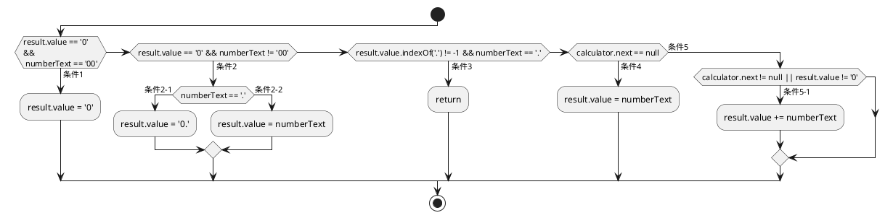

# memo2 2023/09/27~
- [memo2 2023/09/27~](#memo2-20230927)
  - [TODO](#todo)
    - [2023/10/01](#20231001)
  - [`%`と`±`の扱い](#との扱い)
    - [a](#a)
      - [誤ったコード](#誤ったコード)
      - [正しいコード](#正しいコード)
    - [numbers.](#numbers)
  - [数字'5'を入力したとき](#数字5を入力したとき)
  - ['5 + 6 ='](#5--6-)
  - [続けて計算](#続けて計算)

## TODO
### 2023/10/01
- [x] イコールを押した後の表示値はオペランドAとして扱う
    ```
    OperandA: 8
    currentOperator: +
    nextStage: number

    EQUAL
    OperandA: 8
    OperandB: 7
    currentOperator: +
    Result: 15　<- この数値をOperandAにする
    nextStage: number
    Formula: 8 + 7 = 15

    OperandA: 8 <- ここは'15'となるべき
    currentOperator: +
    nextStage: number

    EQUAL
    OperandA: 8
    OperandB: 5
    currentOperator: +
    Result: 13
    nextStage: number
    Formula: 8 + 5 = 13
    ```
    - [x] operationイベントに条件文を追加する

## `%`と`±`の扱い
`%`と`±`は、オペレータとは区別して数値を処理するようにする。

これらは、オペレータとは違い、押すことですぐに結果を出力しなければならない。

オペレータの場合は、2つのオペランドが揃って初めて結果を出力させるため、これらの記号とは挙動が異なり、同じイベントや条件文で扱うと挙動がおかしくなる。

新しく`%`と`±`を処理するためのイベントリスナーを記述する。
(これらの記号の呼び名は、とりあえず'transformer'としておくが、正しい名称がある場合はそちらに置き換える)

transformerは
1. 数字ボタンの押下後のみ機能する = 0のときは無視する
2. 数値入力後にtransformerを押すことで数値を処理する
3. 処理された数値は、オペランドとして扱う
   1. オペランドAとする場合
      1. (User)数値を入力する
      2. (User)transformerを入力する
      3. (Code)入力された数値に指定された処理をする
      4. (Code)その値を`firstOperand`に代入する
      5. (Code)その値を表示する
   2. オペランドBとする場合
      1. (Premise)オペランドAを入力済み
      2. (Premise)オペレータを入力済み
      3. (User)数値を入力する
      4. (User)transformerを入力する
      5. (Code)入力された数値に処理を実行する
      6. (Code)その値を`secondOperand`に代入する
      7. (Code)その値を表示する
4. 入力された数値に定数を掛ける
   1. `%` -> 0.01x
   2. `±` -> -x
   3. `π` -> πx

### a
#### 誤ったコード
```js
    percent() {
        if (this.next === null) { // `next`がnullであるとき...
            this.result = this.next * 0.01; // `result`にx0.01した`next`を代入.
            // nullにx0.01しても意味ねぇわ！！！！！
            return this.result;
        } else {
            this.result = this.pre * 0.01;
            return this.result;
        }
    }
```

#### 正しいコード
```js
percent() {
    if (this.next !== null) { // `next`がnullではないとき...
        this.result = this.next * 0.01; // `result`にx0.01した`next`を代入.
    } else {
        this.result = this.pre * 0.01;
    }
    return this.result;
}
```

### numbers.


1. オペレータを押したあと
2. いずれかの数字を入力するまでは
3. オペランドAの数値は保持し
4. 数字ボタンを押した時に
5. 表示がリセットされ
6. 新しい数値を入力可能にする
```js
if (currentOperator !== null && numberText ===　number) {
   result.value = numberText;
} else if ()
```

```js

class Calculator {
    constructor() {
        this.pre = null;
        this.next = null;
        this.selectedOperator = null;
        this.result = null;
    }

    setOperand(value) {
        if (this.selectedOperator === null) {
            this.pre = parseFloat(value);
        } else {
            this.next = parseFloat(value);
        }
    }

    add() {
        this.result = this.pre + this.next;
        return this.result;
    }

    subtract() {
        this.result = this.pre - this.next;
        return this.result;
    }

    multiply() {
        this.result = this.pre * this.next;
        return this.result;
    }

    divide() {
        if (this.next === 0) {
            throw new Error("0で除算はできません");
        }
        this.result = this.pre / this.next;
        return this.result;
    }

    percent() {
        if (this.next !== null) {
            this.result = this.next * 0.01;
        } else {
            this.result = this.pre * 0.01;
        }
        return this.result;
    }

    plusOrMinus() {
        this.result = -this.pre;
        return this.result;
    }

    reset() {
        this.pre = null;
        this.next = null;
        this.selectedOperator = null;
        this.result = null;
    }

    getResult() {
        return this.result;
    }
}

const numbers = document.querySelectorAll('button[data-numbers');
const tForms = document.querySelectorAll('button[data-transformation]');
const clear = document.querySelector('button[data-clear]');
const clearEntries = document.querySelector('button[data-clearEntries]');
const operations = document.querySelectorAll('button[data-operation]');
const equal = document.querySelector('button[data-equal]');
const result = document.getElementById('result');

let currentOperator = null;
let nextStage = 'number';
const calculator = new Calculator();

function displayResult(result) {
    const resultDisplay = document.querySelector('.result-display');
    const resultPara = document.createElement('p');
    resultPara.classList.add('resultPara');
    resultDisplay.appendChild(resultPara);
    resultPara.innerHTML = result;
    resultDisplay.scrollTop = resultDisplay.scrollHeight;
}

const clearResult = document.getElementById('clearResult');
clearResult.addEventListener('click', () => {
    const removeParas = document.querySelectorAll('.resultPara');
    removeParas.forEach(para => {
        para.remove();
    });
});

result.value = '0';
numbers.forEach(number => {
    number.addEventListener('click', () => {
        const numberText = number.getAttribute('data-numbers');
        if (calculator.pre === null) {
            nextStage = 'operator'; //!
        }

        if (calculator.pre !== null &&
            nextStage === 'operator'
        ) {
            result.value = '';
            nextStage = 'number';
        }

        if (result.value === '0' && numberText === '00') {
            result.value = '0';
        } else if (
            (result.value === '0' && numberText !== '00') ||
            (result.value === '0' && numberText !== '0')) {
            if (numberText === '.') {
                result.value = '0.';
            } else {
                result.value = numberText;
            }
        } else if (
            (result.value.indexOf('.') !== -1) &&
            (numberText === '.')) {
            return;
        } else {
            result.value += numberText;
        }
    });
});

tForms.forEach(transfomer => {
    transfomer.addEventListener('click', () => {
        const tForm = transfomer.innerHTML;
        calculator.setOperand(result.value);
        nextStage = 'operator';
        if (result.value !== '0') {
            switch (tForm) {
                case '%':
                    calculator.percent();
                    result.value = calculator.getResult().toString();
                    break;
                case '±':
                    calculator.plusOrMinus();
                    result.value = calculator.getResult().toString();
                    break;
                default:
                    console.error(`意図しないオペレータ:TransformEvent`);
            }
        }

        console.log(`OperandA: ${calculator.pre}
            \nnextStage: ${nextStage}`);
        displayResult(`OperandA: ${calculator.pre}
            <br>nextStage: ${nextStage}`);
    });
});

operations.forEach(operator => {
    operator.addEventListener('click', () => {
        const operatorText = operator.innerHTML;
        calculator.setOperand(result.value);
        calculator.selectedOperator = currentOperator = operatorText;
        result.value = calculator.pre;
        nextStage = 'number';

        console.log(`OperandA: ${calculator.pre} \ncurrentOperator: ${currentOperator} \nnextStage: ${nextStage}`);
        displayResult(`OperandA: ${calculator.pre}
            <br>currentOperator: ${currentOperator}
            <br>nextStage: ${nextStage}`);
    });
});

clear.addEventListener('click', () => {
    calculator.reset();
    result.value = '0';
    nextStage = 'number';

    console.log(`CLEARED \nOperandA: ${calculator.pre} \nOperandB: ${calculator.next} \ncurrentOperator: ${calculator.selectedOperator} \nResult: ${result.value} \nnextStage: ${nextStage}`);
    displayResult(`CLEARED
        <br>OperandA: ${calculator.pre}
        <br>OperandB: ${calculator.next}
        <br>currentOperator: ${calculator.selectedOperator}
        <br>Result: ${result.value}
        <br>nextStage: ${nextStage}`);
});

clearEntries.addEventListener('click', () => {
    result.value = '0';
    nextStage = 'operator';

    console.log(`CLEARED ENTRIES \nOperandA: ${calculator.pre} \nOperandB: ${calculator.next} \ncurrentOperator: ${calculator.selectedOperator} \nResult: ${result.value} \nnextStage: ${nextStage}`);
    displayResult(`CLEARED ENTRIES
        <br>OperandA: ${calculator.pre}
        <br>OperandB: ${calculator.next}
        <br>currentOperator: ${calculator.selectedOperator}    <br>Result: ${result.value}
        <br>nextStage: ${nextStage}`);
});

equal.addEventListener('click', () => {
    calculator.setOperand(result.value);
    switch (currentOperator) {
        case '+':
            calculator.add();
            result.value = calculator.getResult().toString();
            break;
        case '-':
            calculator.subtract();
            result.value = calculator.getResult().toString();
            break;
        case '÷':
            calculator.divide();
            result.value = calculator.getResult().toString();
            break;
        case '×':
            calculator.multiply();
            result.value = calculator.getResult().toString();
            break;
        default:
            console.error(`意図しないオペレータ:EqualEvent`);
    }

    console.log(`EQUAL \nOperandA: ${calculator.pre} \nOperandB: ${calculator.next} \ncurrentOperator: ${calculator.selectedOperator} \nResult: ${result.value} \nnextStage: ${nextStage} \nFormula: ${calculator.pre} ${currentOperator} ${calculator.next} = ${result.value}`);

    displayResult(`EQUAL
        <br>OperandA: ${calculator.pre}
        <br>OperandB: ${calculator.next}
        <br>currentOperator: ${calculator.selectedOperator}
        <br>Result: ${result.value}
        <br>nextStage: ${nextStage}
        <br>Formula: ${calculator.pre} ${currentOperator} ${calculator.next} = ${result.value}`);
});
```

## 数字'5'を入力したとき
```js
//104
    const numberText = number.getAttribute('data-numbers');

//107
    if (calculator.pre !== null && nextStage === 'operator') {

//117
    if (result.value === '0' && numberText === '00') {

//119
    } else if (

//123
        if (numberText === '.') {

//126
            result.value = numberText;

//136
} // '5'を表示

//331
    });
```

## '5 + 6 ='

```js
//217
    calculator.setOperand(result.value);

//10
        if (this.selectedOperator === null) {

//16
            this.next = parseFloat(value);

//19
    }

//218
    preOperand.value = '0';

//219
    switch (currentOperator) {

//221
            calculator.add();

//22
            calculator.add();

//23
        return this.result;

//23
        return this.result;

//222
            result.value = calculator.getResult().toString();

//73
        return this.result;

//73
        return this.result;

//222
            result.value = calculator.getResult().toString();

//223
            break;

//240
    console.log(`EQUAL \nOperandA: ${calculator.pre} \nOperandB: ${calculator.next} \ncurrentOperator: ${calculator.selectedOperator} \nResult: ${result.value} \nnextStage: ${nextStage} \nFormula: ${calculator.pre} ${currentOperator} ${calculator.next} = ${result.value}`);

//242
    displayLog(`EQUAL
        <br>OperandA: ${calculator.pre}
        <br>OperandB: ${calculator.next}
        <br>currentOperator: ${calculator.selectedOperator}
        <br>Result: ${result.value}
        <br>nextStage: ${nextStage}
        <br>Formula: ${calculator.pre} ${currentOperator} ${calculator.next} = ${result.value}`);

//95
    const resultLog = document.querySelector('.result-log');
//96
    const resultPara = document.createElement('p');
//97
    resultPara.classList.add('resultPara');
//98
    resultLog.appendChild(resultPara);
//99
    resultPara.innerHTML = result;
//100
    resultLog.scrollTop = resultLog.scrollHeight;
//101
}

//249
}

//357
});

```


## 続けて計算
```js
//-----------'5'を押す-----------
//104
    const numberText = number.getAttribute('data-numbers');
//107
    if (calculator.pre !== null && nextStage === 'operator') {
//117
    if (result.value === '0' && numberText === '00') {
//119
    } else if (
//123
        if (numberText === '.') {
//126
            result.value = numberText;
//136
}
//331
    });

//-----------'+'を押す-----------
//341
        const operatorText = operator.innerHTML;
//342
        operationProcess(operatorText);
//164
    calculator.setOperand(result.value);
//10
        if (this.selectedOperator === null) {
//12
            this.pre = parseFloat(value);
//19
    }
//165 - 168
    calculator.selectedOperator = currentOperator = operator;
    preOperand.value = calculator.pre;
    result.value = '0';
    nextStage = 'number';

//170
    if (calculator.result !== null) {
//175
    if (calculator.result === result.value && currentOperator !== null) { //!

//182
    console.log(`OperandA: ${calculator.pre} \ncurrentOperator: ${currentOperator} \nnextStage: ${nextStage}`);
    displayLog(`OperandA: ${calculator.pre}
        <br>currentOperator: ${currentOperator}
        <br>nextStage: ${nextStage}`);
//95
    const resultLog = document.querySelector('.result-log');
    const resultPara = document.createElement('p');
    resultPara.classList.add('resultPara');
    resultLog.appendChild(resultPara);
    resultPara.innerHTML = result;
    resultLog.scrollTop = resultLog.scrollHeight;
}

//186
}

//344
    });

//-----------'2'を押す-----------
//330
        numberProcess(number);
//104
    const numberText = number.getAttribute('data-numbers');
//107
    if (calculator.pre !== null && nextStage === 'operator') {
//117
    if (result.value === '0' && numberText === '00') {
//119
    } else if (
//123
        if (numberText === '.') {
//126
            result.value = numberText;
//136
}
//331
    });

//-----------'+'を押す-----------
//342 - 343
        const operatorText = operator.innerHTML;
        operationProcess(operatorText);
//164
    calculator.setOperand(result.value);
//10
        if (this.selectedOperator === null) {
//16
            this.next = parseFloat(value);
//19
    }
//165
    calculator.selectedOperator = currentOperator = operator;
//166 - 183
    preOperand.value = calculator.pre;
    result.value = '0';
    nextStage = 'number';

    if (calculator.result !== null) {

    if (calculator.result === result.value && currentOperator !== null) { //!

    console.log(`OperandA: ${calculator.pre} \ncurrentOperator: ${currentOperator} \nnextStage: ${nextStage}`);
    console.log(`OperandA: ${calculator.pre} \ncurrentOperator: ${currentOperator} \nnextStage: ${nextStage}`);
//95 - 101
    const resultLog = document.querySelector('.result-log');
    const resultPara = document.createElement('p');
    resultPara.classList.add('resultPara');
    resultLog.appendChild(resultPara);
    resultPara.innerHTML = result;
    resultLog.scrollTop = resultLog.scrollHeight;
}

// 186
}
//344
    });

//-----------'6'を押す-----------
//330
        numberProcess(number);
//104
    const numberText = number.getAttribute('data-numbers');
//107
    if (calculator.pre !== null && nextStage === 'operator') {
//117
    if (result.value === '0' && numberText === '00') {
//119
    } else if (
//123
        if (numberText === '.') {
//126
            result.value = numberText;
//136
}
//331
    });

//-----------'='を押す-----------
//356
    equalProcess();
//217
    calculator.setOperand(result.value);
//10
        if (this.selectedOperator === null) {
//16
            this.next = parseFloat(value);
//19
    }
//218
    preOperand.value = '0';
//219
    switch (currentOperator) {
//221
            calculator.add();
//22
        this.result = this.pre + this.next;
        return this.result;
//73
        return this.result;
//222
            result.value = calculator.getResult().toString();
//223
            break;
//240 - 242
    console.log(`EQUAL \nOperandA: ${calculator.pre} \nOperandB: ${calculator.next} \ncurrentOperator: ${calculator.selectedOperator} \nResult: ${result.value} \nnextStage: ${nextStage} \nFormula: ${calculator.pre} ${currentOperator} ${calculator.next} = ${result.value}`);
    displayLog(`EQUAL
        <br>OperandA: ${calculator.pre}
        <br>OperandB: ${calculator.next}
        <br>currentOperator: ${calculator.selectedOperator}
        <br>Result: ${result.value}
        <br>nextStage: ${nextStage}
        <br>Formula: ${calculator.pre} ${currentOperator} ${calculator.next} = ${result.value}`);
//95
    const resultLog = document.querySelector('.result-log');
    const resultPara = document.createElement('p');
    resultPara.classList.add('resultPara');
    resultLog.appendChild(resultPara);
    resultPara.innerHTML = result;
    resultLog.scrollTop = resultLog.scrollHeight;
    }
//249
}
//357
});

//-----------表示結果'11'-----------

```