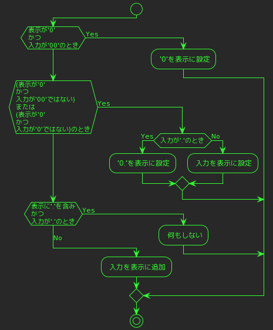

memo.md
=======
- [memo.md](#memomd)
  - [どんな設計にするかメモ](#どんな設計にするかメモ)
  - [参考書のメモ(JavaScript本格入門)](#参考書のメモjavascript本格入門)
  - [引用メモ](#引用メモ)
  - [script.js - 88(条件文) - '0.'を表示するために](#scriptjs---88条件文---0を表示するために)
    - [解決 - '0.'を表示する方法](#解決---0を表示する方法)
  - [オペレータを押したときの挙動](#オペレータを押したときの挙動)
  - [コンストラクタを設計する](#コンストラクタを設計する)
    - [コンストラクタの`this`](#コンストラクタのthis)
  - [`eval`について](#evalについて)
  - [コード置き場](#コード置き場)
    - [ボタンがクリックされたときの処理を設定](#ボタンがクリックされたときの処理を設定)
    - ['0'と'.'を扱う条件分岐](#0とを扱う条件分岐)


|     | A:Onetime      | B:Manytimes      | C:C / CE    | D:% / ±          |
| --- | -------------- | ---------------- | ----------- | ---------------- |
| 0   | Push Num       | Push Num         | Push Num    | Push Num         |
| 1   | Push Operation | Push Operation   | Push C / CE | Push '%' / '±'   |
| 2   | Push Num       | Push Num         | Clear       | Push Operation   |
| 3   | Push `=`       | Show Result      | `END`       | Push Num -> `A2` |
| 4   | Show Result    | Push Operation   |             | Push `=` -> `A4` |
| 5   | `END`          | Push `=` -> `A4` |             |                  |

--------------------------------------------------------------------------------

押した時の挙動
| Push | Numbers   | Operations |
| ---- | --------- | ---------- |
| 0    | Display   | none       |
| 1    | 2nd digit | `END`      |
| 2    | 3rd digit |            |
| 3    | ......... |

--------------------------------------------------------------------------------

± と ÷ の挙動
|     | ±                  | %                    |
| --- | ------------------ | -------------------- |
| 0   | Push Number        | Push Number          |
| 1   | Push ±             | Push %               |
| 2   | Multiply -1 by Num | Multiply 0.01 by Num |
| 3   |                    |                      |

--------------------------------------------------------------------------------

## どんな設計にするかメモ
- (A)最初に押されたボタンが
  1. 数字ボタンなら
       1. 記号ボタンの入力を受け付ける
       2. 数字ボタンの入力を受け付ける
       3. %ボタンの入力を受け付ける
       4. ±ボタンの入力を受け付ける
       5. C/CEボタンの入力を受け付ける
  2. 数字以外のボタンなら
      1. 入力は受け付けない
- (B)２回目に押されたボタンが
  1. 数字ボタンなら
       1. ２桁目を表示する
  2. 記号ボタンなら
       1. オペランド(A)を画面から消す
       2. 次の数字ボタンの入力を受け付ける
  3. %ボタンなら
       1. オペランド(A)に`0.01`を掛ける
       2. (1)を画面に表示する
       3. 記号ボタンの入力を受け付ける
  4. ±ボタンなら
       1. オペランド(A)に`-1`を掛ける
       2. (1)を画面に表示する
          1. 記号ボタンの入力を受け付ける
          2. 数字ボタンの入力を受け付ける
          3. %ボタンの入力を受け付ける
   5. =ボタンなら
      1. 無反応
- (C)3回目に押されたボタンが
  1. 数字ボタンなら
     1. (A-1 -> B-1)３桁目を表示する
  2. 記号ボタンなら
     1. 記号を変更する
- それぞれの処理に応じた関数を作っておき、入力に応じて関数を呼び出す
  - パラメータを設定する?
  - コンストラクタを使う??
  - 押した記号ボタンに応じて前オペランドの数値を関数に渡して処理させ、次のオペランドにする
- 履歴の残し方
  - `p`要素でリスト化する(`=`を押したタイミング)
- コンストラクタで
   1. 数値(A)を入力する
   2. 表示された数値(A)をメソッドに渡す
   3. 数値(B)を入力する
   4. いずれかの記号を押す
      1. 最終的な結果(`=`のとき)または途中の結果を表示する

## 参考書のメモ(JavaScript本格入門)
1. `null` & `undefined`
   1. `null`: 空であることを明示する
   2. `undefined`: 定義されていない、または参照することを想定していない
2. 比較演算子
   1. 三項演算子
   2. `==`,`===`
3. 論理演算子
   1. `&&`,`||`,`!`
4. ループ処理
   1. `do...while`,`while`: 条件式の真偽に応じてループを制御する
   2. `for`: 指定された回数だけループする
   3. `for...in`: 連想配列の中身を順に処理する
   4. `for...of`: 配列の要素を順に処理する
   5. `forEach`: 配列の内容を順に取り出しながら、決められた処理を実行する
5. オブジェクト
   1. コンストラクターとインスタンス
   2. <s>RegExpオブジェクト</s>
   3. `isNaN`
6. 関数
   1. 可変長引数の関数 p.318

## 引用メモ
> オペランドとは オペランドとは、コンピュータの演算における値や変数のことである。  
> オぺランドは演算の種類や内容を表す演算子（オペレータ）によって演算対象となるもので、  
> 例えば「7×3」という計算式があれば、「7」と「3」がオペランドとなる。  
>「7×3」の演算における「×」はオペレータとして、計算の内容を規定する。  

## script.js - 88(条件文) - '0.'を表示するために
```js
if (numberText === '00' && result.value === '0') {
   // '00'を押したときは何もしない
   // すでに '0' が表示されている場合は何もしない
   return;
} else if (result.value === '0' &&
   (numberText !== '00' || numberText !== '0')) {
   // 表示が'0'かつ入力が'00'か'0'ではないとき、
   // 最初の '0' を数字に置き換え
   result.value = numberText;
} else if (result.value === '0' && numberText === '.') {
   // 0が表示されており、かつ'.'を入力したとき
   // '0'を'0.'に置き換える
   result.value = '0.';
}
// else if (result.value === '0' && numberText !== '.') {//!
//    // '0'が表示されており、かつ数字以外の入力がある場合は
//    // 最初の '0' を数字に置き換え
//    result.value = numberText;
// }
else if (result.value.indexOf('.') !== -1 && numberText === '.') {
   // 小数点が含まれている場合でも、
   // さらに小数点を入力しようとしたときは何もしない.
   // 小数点が表示されており、かつ小数点を入力したとき
   // 何もしない
   return;
} else {
   // 数字を連続して入力する
   result.value += numberText;
}
```
-----------------------------------------
```plantuml
!theme crt-green
!pragma useVerticalIf on
start
if (numberText is '00' \nand\n result.value is '0') then
    :return;
else if (result.value is '0' \nand\n (numberText is not '00' \nor\n numberText is not '0')) then
    :result.value = numberText;
else if (result.value is '0' \nand\n numberText is '.') then
    :result.value = '0.';
else if (result.value is '0' \nand\n numberText is not '.') then
    :result.value = numberText;
else if (result.value contains '.' \nand\n numberText is '.') then
    :return;
else
    :result.value += numberText;
endif
stop
```
-----------------------------------------
```plantuml
!theme crt-green
!pragma useVerticalIf on
start
if (入力が'00'\nかつ\n表示が'0'のとき) then
    :何もしない;
else if (表示が'0'かつ\n(入力が'00'ではない\nまたは\n入力が'0'ではないとき)) then
    :表示の'0'を入力値に置換;
else if (表示が'0'のとき\nかつ\n入力が'.'のとき) then
    :'0'を'0.'に置換;
else if (表示が'0'\nかつ\n入力が'.'でないとき) then
    :表示の'0'を入力値に置換;
else if (表示に'.'を含み\nかつ\n入力が'.'のとき) then
    :何もしない;
else
    :表示値の後に入力値を追加;
endif
stop
```
-----------------------------------------
```plantuml
!theme crt-green
!pragma useVerticalIf on
:'.' 入力済みで'3'を入力;
start
if (入力が'00'\nかつ\n表示が'0'のとき) then
    :通過;
else if (表示が'0'かつ\n(入力が'00'ではない\nまたは\n入力が'0'ではないとき)) then
    :通過;
else if (表示が'0'のとき\nかつ\n入力が'.'のとき) then
    :表示が'0'ではない;
    :通過;
else if (表示が'0'\nかつ\n入力が'.'でないとき) then
    :表示が'0'ではない;
    :通過;
else if (表示に'.'を含み\nかつ\n入力が'.'のとき) then
    :'.'は含んでいる;
    :入力は'.'ではない;
    :それまでの値'0.3'に\n'.'を除いた上で\n`result.value`に返す;
else
    :表示値の後に入力値を追加;
endif
stop
```


-----------------------------------------
```js
if (numberText === '00' && result.value === '0') {
   // すでに '0' が表示されている場合は'00'を入力しても何もしない
   //// console.log(result.value, numberText);
   return;
} else if (result.value === '0' &&
   (numberText !== '00' || numberText !== '0')) {
   // 表示が'0'かつ入力が'00'か'0'ではないとき、最初の'0'を数字に置き換え
   //// console.log(result.value, numberText);
   result.value = numberText; // result.value を更新
} else if (result.value === '0' && numberText === '.') {
   // 0が表示されており、かつ'.'を入力したとき末尾に'.'を追加する
   //// console.log(result.value, numberText);
   result.value = '0.';
} else if (result.value.indexOf('.') !== -1 && numberText === '.') {
   // 既に小数点が含まれている場合、'.'を追加しない
   //// console.log(result.value, numberText);
   return;
} else {
   // 数字を連続して入力する
   //// console.log(result.value, numberText);
   result.value += numberText; // result.value を更新
}
```
-----------------------------------------
```js
result.value = '0';
numbers.forEach(number => {
    number.addEventListener('click', () => {
        const numberText = number.getAttribute('data-numbers');
        if (numberText === '00' && result.value === '0') {
            console.log(result.value, numberText);
            return;
        } else if (result.value === '0' &&
            (numberText !== '00' || numberText !== '0')) {
            console.log(result.value, numberText);
            result.value = numberText;
        } else if (result.value === '0' && numberText === '.') {
            console.log(result.value, numberText);
            result.value = '0' + '.';
        } else if (result.value.indexOf('.') !== -1 && numberText === '.') {
            console.log(result.value, numberText);
            return;
        } else {
            console.log(result.value, numberText);
            result.value += numberText;
        }
    });
});
```

### 解決 - '0.'を表示する方法
`if`を入れ子にすることで、数値を画面に表示する`result.value`に<br>
`0.`を表示することができた。

それまでは、'.'ボタンを押しても期待する表示'0.'ではなく'.'のみが<br>
表示されてしまっていた。<br>

問題があったのは
```js
} else if (result.value === '0' &&
   (numberText !== '00' || numberText !== '0')) {
   console.log(result.value, numberText);
   result.value = numberText;
```
この部分で、'.'を押した際にこの条件分岐に引っかかり、<br>
`result.value = '.'`が実行されていた。<br>
そのためにその下の分岐の`result.value = '0' + '.';`<br>
が実行されることなく、結果として'0.'が表示されなかった。

```js
if (result.value === '0' && numberText === '00') {
   console.log(result.value, numberText, 'A');
   result.value = '0';
} else if (
   (result.value === '0' && numberText !== '00') ||
   (result.value === '0' && numberText !== '0')
) {
   if (numberText === '.') {
         result.value = '0.';
         console.log(result.value, numberText, 'Ba');
   } else {
         result.value = numberText;
         console.log(result.value, numberText, 'Bb');
   }
} else if (result.value.indexOf('.') !== -1 && numberText === '.') {
   console.log(result.value, numberText, 'C');
   return;
} else {
   console.log(result.value, numberText, 'D');
   result.value += numberText;
}
```

```plantuml
!theme crt-green
!pragma useVerticalIf on
start
if (表示が'0'\nかつ\n入力が'00'のとき) then (Yes)
    : '0'を表示に設定;
else if ((表示が'0'\nかつ\n入力が'00'ではない)\nまたは\n(表示が'0'\nかつ\n入力が'0'ではない)のとき) then (Yes)
    if (入力が'.'のとき) then (Yes)
        : '0.'を表示に設定;
    else (No)
        : 入力を表示に設定;
    endif
else if (表示に'.'を含み\nかつ\n入力が'.'のとき) then (Yes)
    : 何もしない;
else (No)
    : 入力を表示に追加;
endif
stop
```


## オペレータを押したときの挙動
1. 配列にいれてしまえ -> `evel`を使わざるをえない
2. 配列はやめる

1. 入れた後はオペランドをどこかに保存して`result.value`をクリアする
2. `operations.forEach(operator => {`以下に、
   1. オペレータを押すと表示の数値を変数に格納し
   2. <s>表示をクリアにする</s>
      1. 消す必要なし。ただし押したオペレータを明示する。
   3. 次オペランドを入力したときに前オペランドが消えないよう<br>いずれかのオペレータ押下後は加算代入で付け足していく
   4. メソッドの利用方法を考える

## コンストラクタを設計する
1. 前オペランドと次オペランドをパラメータにした
2. 引数に数値を入れることでオペレータに応じた計算をさせることができた
3. 入力した値を引数にする
4. オペレータを通して処理されたオペランド(A)のResultが次のオペランド(A)になる(?)

```plantuml
!theme crt-green
!pragma useVerticalIf on
title オペランドの処理
start
repeat :オペランド(A)を入力;
    :オペレータを選択;
        ' note left:Note
    :オペランド(B)を入力;
    :Resultを出力;
    backward :Resultを\nオペランド(A)に;
repeat while (新たな数値) is (入力)
stop
```

```plantuml
!theme crt-green
!pragma useVerticalIf on
title オペランドの処理
start
while (新たな数値) is (入力)
    :オペランド(A);
    :オペレータを選択;
    :オペランド(B)を入力;
    :Resultを出力;
    :Resultを\nオペランド(A)に;
endwhile(入力しない)
stop

```

```js
const calculator = new Calculator(20, 10);
console.log(`addition: ${calculator.add()}`);
console.log(`subtraction: ${calculator.subtract()}`);
console.log(`multiplication: ${calculator.multiply()}`);
console.log(`division: ${calculator.divide()}`);
console.log(`percent: ${calculator.percent()}`);
console.log(`plusMinus: ${calculator.plusOrMinus()}`);
console.log('--------------------');
```

### コンストラクタの`this`
> thisキーワードは、`new演算子`によって生成されるインスタンス(つまり自分自身)を表すものです。

## `eval`について
- `eval`は文字列を引数として扱う。
  - 引数が算術式に相当する場合、`eval`は算術式として扱う。
- 悪意ある第三者が悪意あるコードを実行させることが可能であるため、<br>仕様は厳禁である。
- 多くの場合、`eval`は他の方法よりも低速である。
- [eval()](https://developer.mozilla.org/ja/docs/Web/JavaScript/Reference/Global_Objects/eval)
>警告: 文字列から JavaScript を実行することは、<br>
>非常に大きなセキュリティリスクを伴います。<br>
>`eval()` を使用すると、悪意のある者が任意のコードを実行することが<br>
あまりにも簡単になります。<br>
>下記の `eval()` を使わないでください!を参照してください。<br>

---
---
---
## コード置き場
### ボタンがクリックされたときの処理を設定
```js
// ボタンがクリックされたときの処理を設定
buttons.forEach(button => {
    const buttonText = button.innerText; // ボタンのテキストを取得
    button.addEventListener('click', () => {
        // ここで buttonText を使用して処理を行う
        // result.value += buttonText; //`result`に数字を表示する

        // もしオペレータを押したら、`result.value`を変数に格納しディスプレイをクリアし、
        // 各種メソッドを呼び出す
        // ----------
        if (buttonText !== isNaN) { //buttonがNumberであるとき
            console.log(buttonText);
        } else if(buttonText === isNaN){ //buttonがNumberでないとき
            result.value += buttonText;
        }
    });
});
```
### '0'と'.'を扱う条件分岐
```js
result.value = '0'; //* 初期の表示は`0`
numbers.forEach(number => {
    number.addEventListener('click', () => {
        const numberText = number.getAttribute('data-numbers'); // 押された数字
        // console.log(`Number:${numberText}`);
        if (result.value === '0' && numberText === '00') {
            // すでに '0' が表示されている場合は
            // '00'を入力しても'0'を表示する
            // console.log(result.value, numberText, 'A');
            result.value = '0';
        } else if (
            (result.value === '0' && numberText !== '00') ||
            (result.value === '0' && numberText !== '0')
        ) {
            // 表示が'0'かつ入力が'00'または
            // 表示が'0'かつ入力が'0'のとき
            // 表示の'0'を'.'か'0~9'までの数字に置換
            if (numberText === '.') {
                result.value = '0.';
                // console.log(result.value, numberText, 'Ba');
            } else {
                result.value = numberText;
                // console.log(result.value, numberText, 'Bb');
            }
            // result.value を更新
        } else if (result.value.indexOf('.') !== -1 && numberText === '.') { // 既に小数点が含まれている場合、'.'を追加しない
            // console.log(result.value, numberText, 'C');
            return;
        } else { // 数字を連続して入力する
            // console.log(result.value, numberText, 'D');
            result.value += numberText; // result.value を更新
        }
        // console.log('--------------------');
    });
});
```